## 知识点 01 用斜二测画法画平面图形的直观图的步骤

1、在已知图形中取互相垂直的 $x$ 轴和 $y$ 轴，两轴相交于点 $O$ ，画直观图时，把它们画成对应的 $x'$ 轴和 $y'$ 轴，

两轴相交于点 $O'$ ，且使 $\angle x'O'y' = 45^\circ$ （或 $135^\circ$ ），它们确定的平面表示水平面。

2、已知图形中平行于 $x$ 轴或 $y$ 轴的线段，在直观图中分别画成平行于 $x'$ 轴或 $y'$ 轴的线段。

3、已知图形中平行于 $x$ 轴的线段，在直观图中保持原长度不变，平行于 $y$ 轴的线段，长度变为原来地一半。

知识点诠释：用斜二测画法画图的关键是在原图中找到决定图形位置与形状的点并在直观图中画出．一般情

况下，这些点的位置都要通过其所在的平行于 $x$ 、 $y$ 轴的线段来确定，当原图中无需线段时，需要作辅助线段。

【即学即练】

1. 画出如图所示水平放置的等腰梯形的直观图。

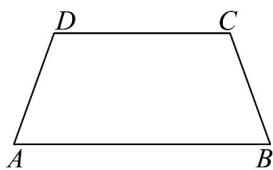

【答案】答案见解析

【详解】画法：（1）如图所示，取 $AB$ 所在直线为 $x$ 轴， $AB$ 的中点 $O$ 为原点，建立直角坐标系，画对应的坐

标系 $x^{\prime}O^{\prime}y^{\prime}$ ，使 $\angle x^{\prime}O^{\prime}y^{\prime} = 45^{\circ}$

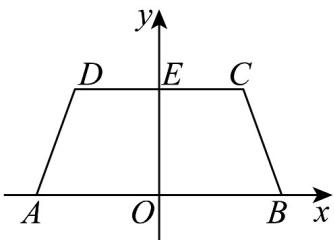

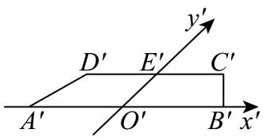

(2) 以 $O'$ 为中点在 $x'$ 轴上取 $A'B' = AB$ ，在 $y'$ 轴上取 $O'E' = \frac{1}{2} OE$ ，以 $E'$ 为中点画 $C'D' // x'$ 轴，并使 $C'D' = CD$

(3) 连接 $B^{\prime}C^{\prime}$ , $D^{\prime}A^{\prime}$ , 所得的四边形 $A^{\prime}B^{\prime}C^{\prime}D^{\prime}$ 就是水平放置的等腰梯形 $ABCD$ 的直观图.

2. 用斜二测画法画出下列图形的直观图（不写画法）·

(1)正方形ABCD

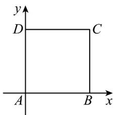

(2)直角梯形ABCD

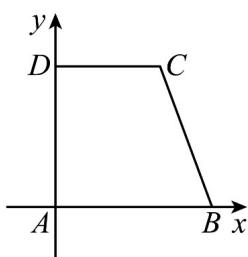

(3) 正 VABC

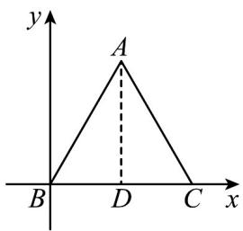

(4)平行四边形OABC

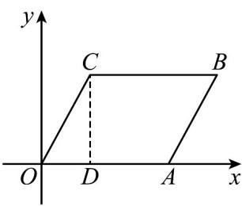

【答案】 $^{(1)}$ 图象见解析

(2)图象见解析

(3)图象见解析

(4)图象见解析

【详解】（1）①作坐标系 $x^{\prime}A^{\prime}y^{\prime}$ ，如图，

② 在 $x'$ 轴上取 $B'$ ，使得 $A'B' = AB$ ，在 $y'$ 轴上取 $D\phi$ ，使得 $A'D' = \frac{1}{2} AD$ ，

③作 $D^{\prime}C^{\prime} // x^{\prime}$ 轴且 $D^{\prime}C^{\prime} = DC$ ，连接 $C^{\prime}B^{\prime}$

④去掉 $x'$ 轴， $y'$ 轴，得四边形 $A'B'C'D'$ ，下右图，为正方形ABCD的直观图.

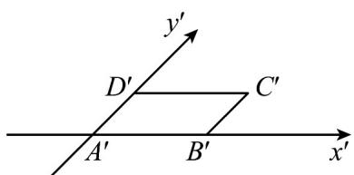

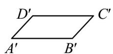

(2) ①作坐标系 $x^{\prime}A^{\prime}y^{\prime}$ ，如图，

② 在 $x'$ 轴上取 $B'$ ，使得 $A'B' = AB$ ，在 $y'$ 轴上取 $D\phi$ ，使得 $A'D' = \frac{1}{2} AD$ 。

③作 $D^{\prime}C^{\prime} // x^{\prime}$ 轴且 $D^{\prime}C^{\prime} = DC$ ，连接 $C^{\prime}B^{\prime}$ ，

④去掉 $x'$ 轴， $y'$ 轴，得四边形 $A'B'C'D'$ ，下右图，为梯形ABCD的直观图。

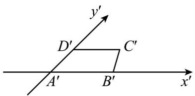

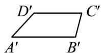

(3) ①作坐标系 $x'B'y'$ ，如图，

②在 $x'$ 轴上取 $C'$ ，使得 $B'C'=BC$ ，设 AB 中点为 D，连接 AD，

取 $B^{\prime}C^{\prime}$ 中点 $D\Phi$ ，作 $D^{\prime}A^{\prime} / / y^{\prime}$ 轴，使得 $A^{\prime}D^{\prime} = \frac{1}{2} AD$

③连接 $A'B'$ ， $A'C'$

④去掉 $x'$ 轴， $y'$ 轴，得三角形 $A'B'C'$ ，下右图，为三角形 $ABC$ 的直观图。

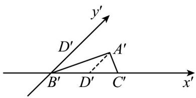

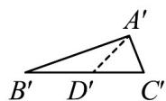

(4) ①作坐标系 $x'O'y'$ ，如图，

②在 $x^{\prime}$ 轴上取 $A^{\prime}$ ，使得 $O^{\prime}A^{\prime} = OA$ ，设 $CD \perp x$ 轴， $D$ 为垂足，在 $O^{\prime}A^{\prime}$ 上取 $D^{\phi}$ ，使得 $O^{\prime}D^{\prime} = OD$ ，作 $D^{\prime}C^{\prime} // y^{\prime}$ 轴，

使得 $D^{\prime}C^{\prime}=\frac{1}{2}DC$

③作 $C'B' // x'$ 轴且 $C'B' = CB$ ，连接 $A'B'$

④去掉 $x^{\prime}$ 轴， $y^{\prime}$ 轴，得四边形 $O^{\prime}A^{\prime}B^{\prime}C^{\prime}$ ，下右图，为正方形ABCD的直观图。

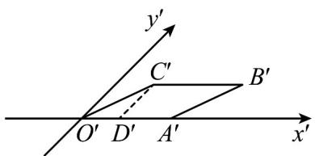

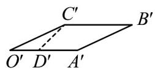
