## 知识点 02 用斜二测画法画空间几何体的直观图的步骤

1、画底面，这时使用平面图形的斜二测画法即可.

2、画 $z^{\prime}$ 轴， $z^{\prime}$ 轴过点 $O^{\prime}$ ，且与 $x^{\prime}$ 轴的夹角为 $90^{\circ}$ ，并画出高线（与原图高线相等，画正棱柱时只需要画侧棱

即可），连线成图。

3、擦去辅助线，被遮线用虚线表示。

【即学即练】

1. 画出上、下底面边长分别为 $2\mathrm{cm}$ 和 $4\mathrm{cm}$ . 高为 $2\mathrm{cm}$ 的正四棱台的直观图

【答案】直观图见解析

【分析】根据斜二测画法，画出水平放置的边长为 $4\mathrm{cm}$ 的正方形ABCD，再画出高和上底面，即可求解

【详解】第一步，用斜二测画法，画出水平放置的边长为 $4 \, cm$ 的正方形 ABCD；

第二步，取四边形 ABCD 对角线中点 O，建立坐标系 xOy，作 $OO' \perp$ 平面 ABCD，且 $OO' = 2cm$ ；

第三步，建立平面坐标系 $x^{\prime}O^{\prime}y^{\prime}$ ，用斜二测画法画出水平放置的边长为 $2\mathrm{cm}$ 的正方形 $A'B'C'D'$

第四步，连接 $AA^{\prime}, BB^{\prime}, CC^{\prime}, DD^{\prime}$ ，得四棱台 $ABCD - A'B'C'D'$ 即为所求，如图：

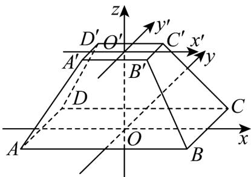

2. 在初中，我们已经学习了一些空间几何体的三视图（正视图、侧视图、俯视图）。如图是某几何体的三视

图（尺寸单位：cm），试画出它的直观图。

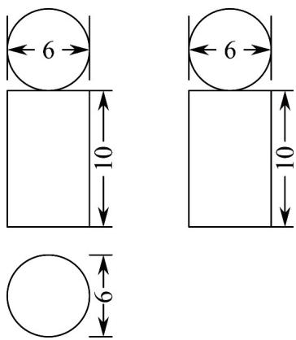

【答案】作图见解析

【分析】由几何体的三视图可知，这个几何体是一个简单组合体．它的下部是一个圆柱，上部是一个球，且

圆柱横截面的直径与球的直径相同．我们可以先画出下部的圆柱，再画出上部的球．

【详解】画法（1）画轴．画 $Ox$ 轴， $Oy$ 轴， $Oz$ 轴，使 $\angle xOy = 45^{\circ}$ ， $\angle xOz = 90^{\circ}$

(2) 画圆柱的直观图．如图 (1)，以点 O 为中点，在 x 轴上截取 AB = 6cm，借助椭圆模板画出下底面 ⊙O

的直观图，在 $z$ 轴上截取 $OO' = 10\mathrm{cm}$ ，过点 $O'$ 分别作 $O'x' \parallel Ox$ ， $O'y' \parallel Oy$ 。以点 $O'$ 为中点，在 $x'$ 轴上截取

$A^{\prime}B^{\prime} = 6\mathrm{cm}$ ，借助椭圆模板画出上底面 $\odot O^{\prime}$ 的直观图．连接 $AA^{\prime}BB^{\prime}$ 与

(3) 画球的直观图．如图 (2)，在 $O^{\prime}z$ 轴上截取 $O^{\prime}O^{\prime \prime} = 3\mathrm{cm}$ ，以点 $O^{\prime \prime}$ 为中心，分别沿三个方向（两两之间的夹角为 $120^{\circ}$ ）画半径为 $3\mathrm{cm}$ 的圆的直观图（三个椭圆）。以点 $O''$ 为圆心画一个半径为 $3\mathrm{cm}$ 的圆。（4）成图。经过整理，就得到了所求几何体的直观图，如图（3）。

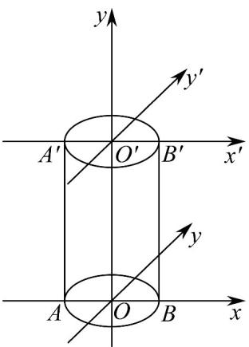
(1)

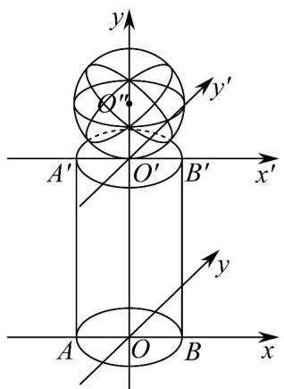

(2)

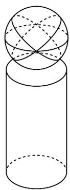

(3)

题型精讲

题型01 水平放置的平面图形直观图的画法

【典例1】用斜二测画法作水平放置的平面图形的直观图时，下列说法一定正确的是（）
A．菱形的直观图还是菱形
B．矩形的直观图是平行四边形
C．平行四边形的直观图可能是梯形
D．正三角形的直观图是等腰三角形

【答案】B
【分析】根据斜二测法的原则，结合各选项中图形的性质，即可判断正误·
【详解】由斜二测法画图原则：平行改斜，垂直不变，横等纵半竖不变，可见为实，遮为虚，对于选项A，菱形的直观图是平行四边形，所以A错误，
对于选项B，矩形的直观图为平行四边形，所以B正确，

对于选项 $^{C}$ ，平行四边形的直观图是平行四边形，所以 $^{C}$ 错误，

对于选项 $^{D}$ ，正三角形的直观图中高为原来的一半且与底边成 $45^{\circ}$ ，其不为等腰三角形，所以 $^{D}$ 错误，

故选：B.

## 方法技巧

画水平放置的平面图形的直观图的注意事项：在画水平放置的平面图形的直观图时，选取适当的直角坐标系是关键，一般要使平面多边形尽可能多的顶点落在坐标轴上，以便于画点。原图中不平行于坐标轴的线段可以通过作平行于坐标轴的线段来作出其对应线段。

【变式1】利用斜二测画法画边长为 $3cm$ 的正方形的直观图，正确的是图中的（）

【答案】

3

A

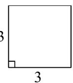

3

B 1.5

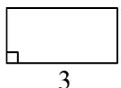

3

C

D

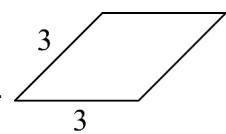

【答案】C

【分析】利用斜二测画法作出直观图，可得结果·

【详解】作出正方形的斜二测直观图如下图所示（单位：cm）：

故选：C.

【变式2】如图所示，在VABC中， $AC = 12\mathrm{cm}$ ， $AC$ 边上的高 $BD = 12\mathrm{cm}$

(1)画出水平放置的VABC的直观图；

(2)求直观图的面积.

【答案】(1)作图见解析 (2) $18\sqrt{2}\left(\mathrm{cm}^{2}\right)$

【分析】（ $^{1}$ ）利用斜二测画法画出直观图即可；

(2) 作 $B'E \perp A'C'$ ， $E$ 为垂足，求出 $B'E = 3\sqrt{2}$ 即可求解。

【详解】（1）①以 $D$ 为原点， $AC$ 所在直线为 $x$ 轴， $DB$ 所在直线为 $y$ 轴建立平面直角坐标系，如图①

①

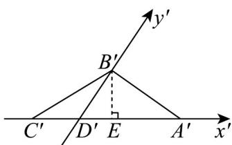
②

②画出对应的 $x'$ ， $y'$ 轴，使 $\angle x'D'y'=45^{\circ}$ ，

在 $x'$ 轴上取点 $A'$ ， $C'$ ，使 $D'A'=DA$ ， $D'C'=DC$

在 $y'$ 轴上取点 $B'$ ，使 $D'B' = \frac{1}{2} DB$

连接 $A'B'$ ， $C'B'$ ，则 $\triangle A'B'C'$ 即为 VABC 的直观图，如图②。

(2) 在图②中，作 $B^{\prime}E \perp A^{\prime}C^{\prime}$ ， $E$ 为垂足，

$$
\because D ^ {\prime} B ^ {\prime} = \frac {1}{2} D B = 6 (\mathrm{cm}), \angle B ^ {\prime} D ^ {\prime} E = 4 5 ^ {\circ}, \therefore B ^ {\prime} E = 6 \times \frac {\sqrt {2}}{2} = 3 \sqrt {2}
$$

$$
\therefore S _ {\triangle A ^ {\prime} B ^ {\prime} C ^ {\prime}} = \frac {1}{2} \times A ^ {\prime} C ^ {\prime} \times B ^ {\prime} E = \frac {1}{2} \times 1 2 \times 3 \sqrt {2} = 1 8 \sqrt {2} (\mathrm{cm} ^ {2}).
$$

【变式3】如图，已知等腰三角形 $ABC$ ，则如图所示①②③④的四个图中，可能是VABC的直观图的有

( )

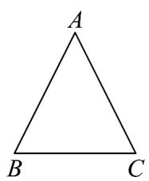

A. 1个

B. 2个

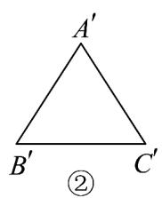

C. 3个

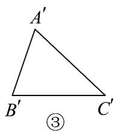

D. 4个

【答案】B

【分析】按照直观图的概念依次判断即可·

【详解】等腰三角形画成直观图后，原来的腰长不相等，①②不正确，

③为 $\angle x^{\prime}O^{\prime}y^{\prime}=135^{\circ}$ 的直观图，④为 $\angle x^{\prime}O^{\prime}y^{\prime}=45^{\circ}$ 的直观图.

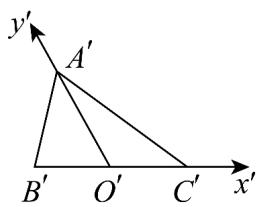

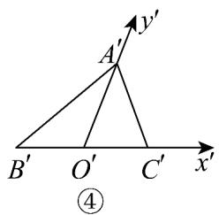

故可能是VABC的直观图的有：③④·故选：B.

题型02 几何体的直观图画法

【典例1】水平放置的正方体的六个面分别用“前面、后面、上面、下面、左面、右面”表示，如图是一个正方

体的平面展开图(图中数字写在正方体的外表面上)，若图中“0”上方的“2”在正方体的上面，则这个正方体的下

面是（ ）

<table><tr><td>2</td><td></td></tr><tr><td>0</td><td>2</td></tr><tr><td></td><td>6 快</td></tr><tr><td></td><td>乐</td></tr></table>

A.2 B.6 C.快 D.乐

## 【答案】B

【分析】将正方体平面展开图还原为正方体，根据已知条件“图中 $^{0}$ 上方的 $^{2}$ 在正方体的上面”，来确定正方

体的下面对应的面·

【详解】在正方体的平面展开图中，相对的面在展开图中是间隔出现的，

观察此展开图可知，“2”与“6”是相对的面，“0”与“快”是相对的面，“1”与“乐”是相对的面；

已知图中“0”上方的“2”在正方体的上面，因为正方体中相对的面一个在上面时，

另一个就在下面，而“2”相对的面是“6”.

故选：B.

## 方法技巧

画空间几何体的直观图的注意事项

（1）首先在原几何体上建立空间直角坐标系 $Oxyz$ ，并且把它们画成对应的 $x'$ 轴与 $y'$ 轴，两轴交于点 $O'$ ，且使 $\angle x'O'y' = 45^\circ$ （或 $135^\circ$ ），它们确定的平面表示水平面，再作 $z'$ 轴与平面 $x'O'y'$ 垂直。

(2) 作空间图形的直观图时平行于 $x$ 轴的线段画成平行于 $x'$ 轴的线段并且长度不变.

(3) 平行于 $y$ 轴的线段画成平行于 $y'$ 轴的线段，且线段长度画成原来的一半。

(4) 平行于 $z$ 轴的线段画成平行于 $z'$ 轴的线段并且长度不变.

【变式1】若把一个高为 $10\mathrm{cm}$ 的圆柱的底面画在 $x^{\prime}O^{\prime}y^{\prime}$ 平面上，则圆柱的高应画成（ ）．A．平行于 $z^{\prime}$ 轴且大小为 $10\mathrm{cm}$ B．平行于 $z^{\prime}$ 轴且大小为 $5\mathrm{cm}$ C．与 $z^{\prime}$ 轴成 $45^{\circ}$ 且大小为 $10\mathrm{cm}$ D．与 $z^{\prime}$ 轴成 $45^{\circ}$ 且大小为 $5\mathrm{cm}$

【答案】A

【分析】根据斜二测画法，即可判断选项·

【详解】平行于 z 轴（或在 z 轴上）的线段，在直观图中的方向和长度都与原来保持一致，

所以圆柱的高应画成平行于 $z'$ 轴且大小为 10cm.

故选：A

【变式2】一个建筑物上部为四棱锥，下部为长方体，且四棱锥的底面与长方体的上底面尺寸一样，已知长

方体的长、宽、高分别为 $20\mathrm{m}$ 、 $5\mathrm{m}$ 、 $10\mathrm{m}$ ，四棱锥的高为 $8\mathrm{m}$ ，若按 $1:1000$ 的比例画出它的直观图，那么

直观图中，长方体的长、宽、高和棱锥的高应分别为（）
A. 4 cm, 1 cm, 2 cm, 1.6 cm
B. 4 cm, 0, 5 cm, 2 cm, 0.8 cm
C. 4 cm, 0, 5 cm, 2 cm, 1.6 cm
D. 2 cm, 0, 25 cm, 1 cm, 0.8 cm

【答案】D

【分析】根据条件所给的比例结合斜二测画直观图的画法规则即可求解·

【详解】由比例可知，所画长方体的长、宽、高和四棱锥的高分别为 2cm，0.5cm，1cm 和 0.8cm，

又因为斜二测画直观图的画法：

已知图形中平行于 $x$ 轴的线段，在直观图中平行于 $x^{\prime}$ ，保持长度不变；

已知图形中平行于 y 轴的线段，在直观图中平行于 $y'$ 轴，长度变为原来的一半；

已知图形中平行于 z 轴的线段，在直观图中平行于 $z'$ 轴，保持长度不变。

所以该建筑物按1:1000的比例画出它的直观图，

直观图中，长方体的长、宽、高和棱锥的高应分别为 $2\mathrm{cm}$ ， $0.25\mathrm{cm}$ ， $1\mathrm{cm}$ 和 $0.8\mathrm{cm}$

故选：D.

【变式3】已知直三棱柱 $ABC - A_{1}B_{1}C_{1}$ ，的底面是等腰直角三角形，且 $AB = AC = 4$ ，侧棱 $AA_{1} = 5$ 。在给定

的坐标系中，用斜二测画法画出该三棱柱的直观图．（不要求写出画法，但要标上字母，并保留作图痕迹）

【答案】作图见解析

【分析】根据斜二测画法的原则，可画出直观图·

【详解】如图所示.

