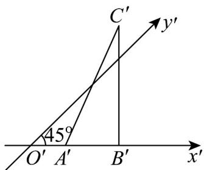

<!-- question-source:start -->
【变式1】如图， $\triangle A'B'C'$ 表示水平放置的VABC根据斜二测画法得到的直观图， $A'B'$ 在 $x'$ 轴上， $B'C'$ 与 $x'$

轴垂直，且 $B^{\prime}C^{\prime} = 2\sqrt{2}$ ，则VABC的边AB上的高为（）

A. 2 B. 4 C. $4\sqrt{2}$ D. 8
<!-- question-source:end -->

![[高中/课堂同步/题库/人教A版高中数学同步讲义(2026)/02_必修第二册/第八章 立体几何初步/讲义/专题8_2_立体图形的直观图_高效培优讲义_/题型03_与直观图还原有关的计算问题_sec_05/questions/answers/Q00065151A1.md]]
