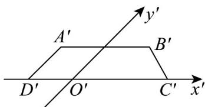

<!-- question-source:start -->
【变式2】如图所示，梯形 $A'B'C'D'$ 是水平放置的四边形ABCD根据斜二测画法得到的直观图，其中 $A'D'//O'y'$ ， $A'B'//C'D'$ ， $A'B' = \frac{2}{3} C'D' = 2$ ， $A'D' = O'D' = 1$ 。

(1)画出原四边形ABCD；

(2)分别求出原四边形ABCD与梯形 $A'B'C'D'$ 的面积.
<!-- question-source:end -->

![[高中/课堂同步/题库/人教A版高中数学同步讲义(2026)/02_必修第二册/第八章 立体几何初步/讲义/专题8_2_立体图形的直观图_高效培优讲义_/题型03_与直观图还原有关的计算问题_sec_05/questions/answers/Q00065152A1.md]]
