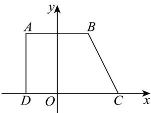

> [!faq]- 《专题8_2_立体图形的直观图_高效培优讲义_》官方解析
>
> > [!success]- **【答案】** (1)答案见解析 (2)5， $\frac{5\sqrt{2}}{4}$
>
> > [!note]- **【分析】**
> > （ $^{1}$ ）利用斜二测画法的规则即可画出原四边形 ABCD；
> >
> > (2) 利用梯形的面积公式求解即可.
>
> > [!note]- **【解析】**
> > （1）由题意得 $C^{\prime}D^{\prime} = 3$
> >
> > 如图，建立平面直角坐标系 $xOy$ ，
> >
> > 
> >
> > 在 $x$ 轴上截取 $OD = O'D' = 1$ ， $CD = C'D' = 3$ ， $OC = CD - OD = 2$
> >
> > 在过点 D 的 y 轴的平行线上截取 $DA = 2D'A' = 2$
> >
> > 在过点 A 的 x 轴的平行线上截取 $AB = A'B' = 2$ ，
> >
> > 连接 BC，即可得到原四边形 ABCD。
> >
> > (2) 由题意得，原四边形 ABCD 是直角梯形，且 AB = 2，CD = 3，AD = 2
> >
> > 故四边形 ABCD 的面积为 $\frac{2+3}{2} \times 2 = 5$ ，
> >
> > 又直观图中梯形的高为 $A^{\prime}D^{\prime}\sin45^{\circ}=\frac{\sqrt{2}}{2}$ ， $A^{\prime}B^{\prime}=2$ ， $C^{\prime}D^{\prime}=3$
> >
> > 所以四边形 $A'B'C'D'$ 的面积为 $\frac{1}{2}\times(2+3)\times\frac{\sqrt{2}}{2}=\frac{5\sqrt{2}}{4}$
