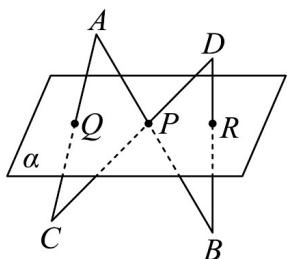

<!-- question-source:start -->
1. 如图所示， $AB \cap \alpha = P$ ， $CD \cap \alpha = P$ ， $A$ ， $D$ 与 $B$ ， $C$ 分别在平面 $\alpha$ 的两侧， $AC \cap \alpha = Q$ ， $BD \cap \alpha = R$

求证：P，Q，R三点共线·

<!-- question-source:end -->

![[高中/课堂同步/题库/人教A版高中数学同步讲义(2026)/02_必修第二册/第八章 立体几何初步/讲义/专题8_4_空间点_直线_平面之间的位置关系_高效培优讲义_/即学即练_sec_05/questions/answers/Q00065165A1.md]]
