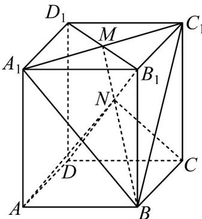

<!-- question-source:start -->
2. 在长方体 $ABCD - A_{1}B_{1}C_{1}D_{1}$ 中， $M$ 是 $A_{1}C_{1}$ 和 $B_{1}D_{1}$ 的交点， $B_{1}D$ 与平面 $A_{1}BC_{1}$ 交于点 $N$ .

(1)证明： $B,N,M$ 三点共线·

(2)若 $AB = BC = 4, BB_{1}$ 为长方体 $ABCD - A_{1}B_{1}C_{1}D_{1}$ 的一条高且， $BB_{1} = 6$ ，求四棱锥 $N - ABCD$ 的体积.
<!-- question-source:end -->

![[高中/课堂同步/题库/人教A版高中数学同步讲义(2026)/02_必修第二册/第八章 立体几何初步/讲义/专题8_4_空间点_直线_平面之间的位置关系_高效培优讲义_/即学即练_sec_05/questions/answers/Q00065166A1.md]]
