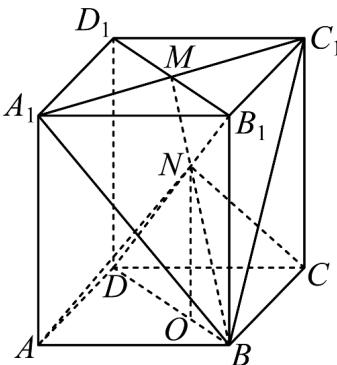

> [!faq]- 《专题8_4_空间点_直线_平面之间的位置关系_高效培优讲义_》官方解析
>
> > [!success]- **【答案】** (1)证明见解析 (2) $\frac{64}{3}$ .
>
> > [!note]- **【分析】**
> > （1）证明 $N \in$ 平面 $BB_{1}D_{1}D$ ，又 $N \in$ 平面 $A_{1}BC_{1}$ ，平面 $BB_{1}D_{1}D \cap$ 平面 $A_{1}BC_{1} = BM$ ，可证 B，N，M
> >
> > 三点共线.
> >
> > (2) 连接 BD，可得 $ON = \frac{2}{3} BB_{1} = 4$ ，可求四棱锥 N - ABCD 的体积。
>
> > [!note]- **【解析】**
> > （1）因为 $N \in B_{1}D, B_{1}D \subset$ 平面 $BB_{1}D_{1}D$
> >
> > 所以 $N \in$ 平面 $BB_{1}D_{1}D$
> >
> > 又 $N \in$ 平面 $A_{1}BC_{1}$ ，平面 $BB_{1}D_{1}D \cap$ 平面 $A_{1}BC_{1} = BM$
> >
> > 所以 $N \in BM$
> >
> > 即 $B, N, M$ 三点共线·
> >
> > 
> >
> > (2) 连接 BD，则 $\triangle B_{1}MN$ 与 $\triangle DBN$ 相似，
> >
> > 所以 $\frac{B_1N}{DN} = \frac{B_1M}{DB} = \frac{1}{2}$
> >
> > 所以 $DN = \frac{2}{3} DB_{1}$
> >
> > 在 $\triangle BDB_{1}$ 中，作 $NO//BB_{1}$ ，交 $DB$ 于点 $O$ ，则 $ON = \frac{2}{3} BB_{1} = 4$
> >
> > 所以 $V_{N-ABCD}=\frac{1}{3}\times4\times4\times4=\frac{64}{3}$
