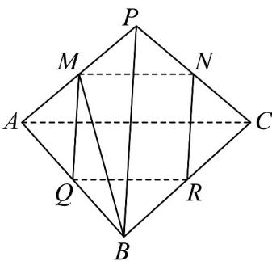

<!-- question-source:start -->
1. 如图，已知正四面体 $P - ABC$ ， $M, N, Q, R$ 分别是棱 $PA, PC, AB, BC$ 的中点。

(1)证明：四边形 $MNRQ$ 为菱形；

(2)求异面直线 BM 与 QR 所成角的余弦值.
<!-- question-source:end -->

![[高中/课堂同步/题库/人教A版高中数学同步讲义(2026)/02_必修第二册/第八章 立体几何初步/讲义/专题8_4_空间点_直线_平面之间的位置关系_高效培优讲义_/即学即练_sec_07/questions/answers/Q00065167A1.md]]
