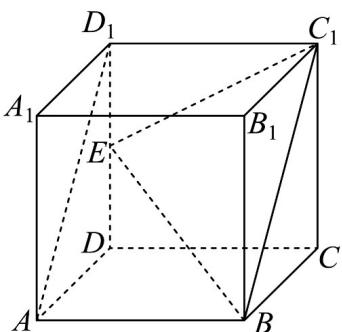
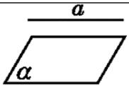

> [!faq]- 《专题8_4_空间点_直线_平面之间的位置关系_高效培优讲义_》官方解析
>
> > [!success]- **【答案】** B
>
> > [!note]- **【分析】**
> > 根据异面直线的定义找到对应的平面角，应用余弦定理求其大小即可·
>
> > [!note]- **【解析】**
> > 由题设 $AB // C_1 D_1$ 且 $AB = C_1 D_1$ ，即四边形 $ABC_1 D_1$ 为平行四边形，故 $AD_1 // BC_1$ ，所以异面直线 $BE$ 与 $AD_1$ 所成角，即为直线 $BE$ 与 $BC_1$ 所成的角 $\angle EBC_1$ 或其补角，
> >
> > 设正方体棱长为 $^{2}$ ，则 $BC_{1}=2\sqrt{2}, BE=3, EC_{1}=\sqrt{5}$ ，故 $\cos\angle EBC_{1}=\frac{8+9-5}{2\times2\sqrt{2}\times3}=\frac{\sqrt{2}}{2}$
> >
> > 结合异面直线夹角的范围知，异面直线 BE 与 $AD_{1}$ 所成角为 $\frac{\pi}{4}$
> >
> > 故选：B
> >
> > 
> >
> > 知识点 06 直线与平面的位置关系
> >
> > <table><tr><td>位置关系</td><td>图形表示</td><td>符号表示</td><td>公共点</td></tr><tr><td>直线a在平面α内</td><td></td><td>a⊂α</td><td>有无数个公共点</td></tr><tr><td>直线a与平面α相交</td><td></td><td>a∩α=A</td><td>有且只有一个公共点</td></tr><tr><td>直线a与平面α平行</td><td></td><td>a//α</td><td>无公共点</td></tr></table>
