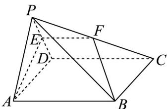

<!-- question-source:start -->
2．如图，在四棱锥 P-ABCD 中，底面 ABCD 是边长为 $^{4}$ 的正方形，侧面 PAD 是正三角形，侧面 PAD⊥底

面 $ABCD$ ， $E$ 为棱 $PD$ 的中点，平面 $ABE$ 与棱 $PC$ 交于点 $F$ ：

(1)求证： $F$ 为棱 $PC$ 的中点；

(2)求直线 BF 与平面 ABCD 所成角的正切值.
<!-- question-source:end -->

![[高中/课堂同步/题库/人教A版高中数学同步讲义(2026)/02_必修第二册/第八章 立体几何初步/讲义/专题8_4_空间点_直线_平面之间的位置关系_高效培优讲义_/即学即练_sec_08/questions/answers/Q00065170A1.md]]
