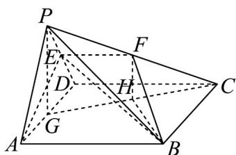

> [!faq]- 《专题8_4_空间点_直线_平面之间的位置关系_高效培优讲义_》官方解析
>
> > [!success]- **【答案】** $^{(1)}$ 证明见解析 (2) $\frac{\sqrt{39}}{13}$
>
> > [!note]- **【分析】**
> > （1）因为 E 是 PD 的中点，若证明 $CD \parallel EF$ ，那么即可证明 F 是 PC 的中点。
> >
> > (2) 首先确定 $\angle FBH$ 为直线 BF 与平面 ABCD 所成的角，然后根据线段、角度的关系求出其正切值.
>
> > [!note]- **【解析】**
> > （1）因为四边形ABCD为正方形，所以 $CD \parallel AB$
> >
> > 又 $CD \notin$ 平面 ABE ， $AB \subset$ 平面 ABE ，
> >
> > 所以 $CD / /$ 平面ABE.
> >
> > 因为 $CD \subset$ 平面 PCD ，平面 $ABE \cap$ 平面 PCD = EF ，
> >
> > 所以 CD // EF .
> >
> > 因为 E 为棱 PD 的中点，所以 F 为棱 PC 的中点。
> >
> > (2) 取 AD 的中点为 G，连接 PG, CG，取 CG 的中点为 H，连接 FH, BH
> >
> > 因为 $\triangle PAD$ 为正三角形， $G$ 为棱 $AD$ 的中点，
> >
> > 所以 $PG \perp AD$
> >
> > 又平面 $PAD \perp$ 平面 $ABCD$ ，平面 $PAD \cap$ 平面 $ABCD = AD$ ， $PG \subset$ 平面 $PAD$ ，所以 $PG \perp$ 平面 $ABCD$
> >
> > 因为 F, H 分别为 PC, CG 的中点，
> >
> > 
> >
> > 所以 FH 是 $\triangle PCG$ 的中位线，所以 $FH \parallel PG$ ，即 $FH \perp$ 平面 ABCD，
> >
> > 所以 $\angle FBH$ 为直线 BF 与平面 ABCD 所成的角.
> >
> > 在 $\mathrm{Rt}^{\triangle}$ $CDG$ 中， $CG = \sqrt{CD^2 + DG^2} = 2\sqrt{5}$ ，所以 $\cos \angle BCH = \sin \angle DCG = \frac{DG}{CG} = \frac{\sqrt{5}}{5}$
> >
> > 在VBCH中， $BH^{2} = CH^{2} + BC^{2} - 2 \times CH \times BC \times \cos \angle BCH = 5 + 16 - 8 = 13$ ，所以 $BH = \sqrt{13}$
> >
> > 在 Rt△ FBH 中， $FH=\frac{1}{2}PG=\sqrt{3}$
> >
> > 所以 $\tan\angle FBH=\frac{FH}{BH}=\frac{\sqrt{3}}{\sqrt{13}}=\frac{\sqrt{39}}{13}$
> >
> > $$
> > \sqrt {3 9}
> > $$
> >
> > 故直线 $BF$ 与平面 $ABCD$ 所成角的正切值为 13
