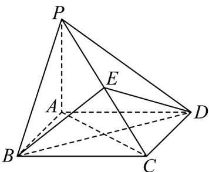

> [!faq]- 《专题8_4_空间点_直线_平面之间的位置关系_高效培优讲义_》官方解析
>
> > [!success]- **【答案】** $\frac{2\pi}{3}$
>
> > [!note]- **【分析】**
> > 过 $B$ 作 $BE \perp PC$ 交 $PC$ 于 $E$ ，连接 $DE, BD, AC$ ，由线面垂直的性质结合勾股定理可得 $\triangle PCB \cong \triangle PCD$
> >
> > 则 $DE \perp PC$ ，再根据二面角的定义可知 $\angle BED$ 即为二面角 $B - PC - D$ 的平面角，求 $\angle BED$ 即可·
>
> > [!note]- **【解析】**
> > 如图过 B 作 $BE \perp PC$ 交 PC 于 E，连接 DE, BD, AC
> >
> > 
> >
> > 因为 $PA \perp$ 底面 $ABCD$ ， $AB, AD, AC \subset$ 底面 $ABCD$ ，所以 $PA \perp AB$ ， $PA \perp AD$ ， $PA \perp AC$
> >
> > 因为底面 $ABCD$ 是正方形， $AB = AD$
> >
> > 所以由勾股定理可得 $\sqrt{PA^2 + AB^2} = \sqrt{PA^2 + AD^2}$ ，即 $PB = PD$
> >
> > 又 BC = DC ， PC = PC ，所以 $\triangle PCB \cong \triangle PCD$ ，所以 $DE \perp PC$ ，
> >
> > 因为平面 $PBC \cap$ 平面 $PDC = PC$ ，所以 $\angle BED$ 即为二面角 $B - PC - D$ 的平面角，
> >
> > 因为 $PA = AB = 1$ ，由勾股定理可得 $AC = BD = \sqrt{2}$ ， $PC = \sqrt{PA^2 + AC^2} = \sqrt{3}$ ， $PB = \sqrt{PA^2 + AB^2} = \sqrt{2}$
> >
> > 设 $PE = x$ ，则 $EC = \sqrt{3} -x$ ，所以由 $\sqrt{PB^2 - PE^2} = \sqrt{BC^2 - EC^2}$ 得 $\left(\sqrt{2}\right)^2 -x^2 = 1^2 -\left(\sqrt{3} -x\right)^2$
> >
> > 解得 $x=\frac{2\sqrt{3}}{3}$
> >
> > 所以 $BE = DE = \sqrt{PB^{2} - PE^{2}} = \frac{\sqrt{6}}{3}$
> >
> > 在 中由余弦定理可得 $\cos\angle BED=\frac{BE^{2}+DE^{2}-BD^{2}}{2BE\cdot DE}=\frac{\frac{2}{3}+\frac{2}{3}-2}{2\times\frac{\sqrt{6}}{3}\times\frac{\sqrt{6}}{3}}=-\frac{1}{2}$
> >
> > 因为 $\angle BED\in (0,\pi)$ ，所以 $\angle BED = \frac{2\pi}{3}$
> >
> > 即二面角 $B - PC - D$ 的大小为 $\frac{2\pi}{3}$
> >
> > 故答案为： $\frac{2\pi}{3}$
