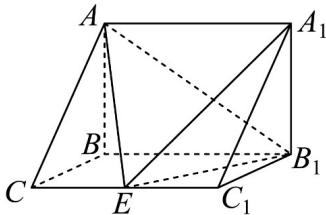

<!-- question-source:start -->
4．如图，在三棱柱 $ABC-A_{1}B_{1}C_{1}$ 中， $AB\perp$ 侧面 $BB_{1}C_{1}C$ ，BC=1， $BB_{1}=2$ ， $AB=\sqrt{2}$ ， $\angle BCC_{1}=60^{\circ}$

(1)在棱 $CC_{1}$ （不包含端点 $C,C_{1}$ ）上确定一点 $E$ 的位置，使得 $EB_{1} \perp EA$ ，并说明理由；

(2)在（1）的条件下，求二面角 $A - EB_{1} - A_{1}$ 的平面角的余弦值.
<!-- question-source:end -->

![[高中/课堂同步/题库/人教A版高中数学同步讲义(2026)/02_必修第二册/第八章 立体几何初步/讲义/专题8_4_空间点_直线_平面之间的位置关系_高效培优讲义_/强化训练_sec_18/questions/answers/Q00065200A1.md]]
