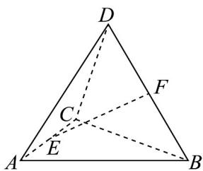

<!-- question-source:start -->
6. 在四面体 $ABCD$ 中， $E, F$ 分别为棱 $AC, BD$ 的中点， $AD = 6, BC = 4, EF = \sqrt{7}$ ，则异面直线 $AD$ 与 $BC$ 所成

角为（ ）

A. $\frac{\pi}{12}$ B. $\frac{\pi}{6}$ C. $\frac{\pi}{4}$ D. $\frac{\pi}{3}$
<!-- question-source:end -->

![[高中/课堂同步/题库/人教A版高中数学同步讲义(2026)/02_必修第二册/第八章 立体几何初步/讲义/专题8_4_空间点_直线_平面之间的位置关系_高效培优讲义_/强化训练_sec_18/questions/answers/Q00065202A1.md]]
