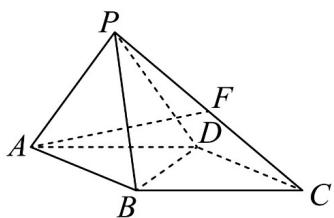

<!-- question-source:start -->
8. 如图，在四棱锥 $P - ABCD$ 中，四边形 $ABCD$ 是边长为 2 的菱形， $\angle BAD = 60^{\circ}$ ， $PB = PD$ ， $PA = \sqrt{3}$

$PC = 3$ ，点 $F$ 为棱 $PC$ 的中点.

(1)求证： $AF \perp BD$ ；

(2)求二面角 $B - PA - D$ 的余弦值；

(3)求直线 AF 与平面 PAB 所成角的正弦值.
<!-- question-source:end -->

![[高中/课堂同步/题库/人教A版高中数学同步讲义(2026)/02_必修第二册/第八章 立体几何初步/讲义/专题8_4_空间点_直线_平面之间的位置关系_高效培优讲义_/强化训练_sec_18/questions/answers/Q00065204A1.md]]
