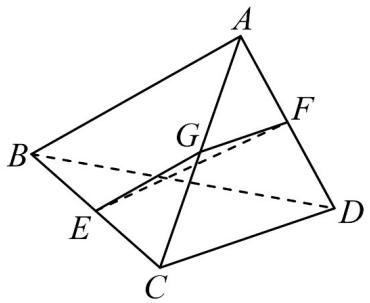

> [!faq]- 《专题8_4_空间点_直线_平面之间的位置关系_高效培优讲义_》官方解析
>
> > [!success]- **【答案】** C
>
> > [!note]- **【分析】**
> > 取 $AC$ 的中点 $G$ ，连接 $EG,FG$ ，由线线角的定义找到 $EF$ 与 $AB$ 、 $AB$ 与 $CD$ 所成角的平面角，根据
> >
> > 已知求 $EF$ 与 $AB$ 所成角的大小·
>
> > [!note]- **【解析】**
> > 如图所示，取 AC 的中点 G ，连接 EG,FG
> >
> > 所以 $EG // AB$ 且 $EG = \frac{1}{2} AB$ ， $GF // CD$ 且 $GF = \frac{1}{2} CD$ ，
> >
> > 综上， $\angle GEF$ 或其补角为 $EF$ 与 $AB$ 所成的角， $\angle EGF$ 或其补角为 $AB$ 与 $CD$ 所成的角。
> >
> > 
> >
> > 与所成的角为，或
> >
> > $\because AB \quad CD \quad 30^{\circ} \quad \therefore \angle EGF = 30^{\circ} \quad 150^{\circ}$
> >
> > 由 $AB = CD$ ，知 $EG = FG$ ，则 $\triangle EFG$ 为等腰三角形，
> >
> > 当 $\angle EGF = 30^{\circ}$ 时， $\angle GEF = 75^{\circ}$ ；当 $\angle EGF = 150^{\circ}$ 时， $\angle GEF = 15^{\circ}$ ，
> >
> > 故 EF 与 AB 所成角的大小为 $15^{\circ}$ 或 $75^{\circ}$ .
> >
> > 故选 **C**
