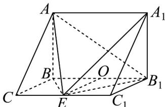
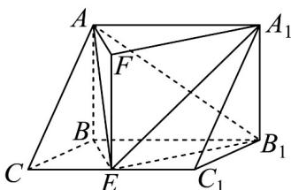

> [!faq]- 《专题8_4_空间点_直线_平面之间的位置关系_高效培优讲义_》官方解析
>
> > [!success]- **【答案】** $^{(1)}$ 点 E 在 $CC_{1}$ 的中点处，理由见解析 (2) $\frac{\sqrt{6}}{3}$
>
> > [!note]- **【分析】**
> > （ $^{1}$ ）根据线面垂直的判定和性质推导出E的位置·
> >
> > (2) 先确定二面角 $A - EB_{1} - A_{1}$ 的平面角，然后根据垂直关系求出其余弦值即可.
>
> > [!note]- **【解析】**
> > （1）如图，由因为 $AB \perp$ 平面 $BB_{1}C_{1}C$ ， $EB_{1} \subset$ 平面 $BB_{1}C_{1}C$ ， $AB \perp EB_{1}$
> >
> > 
> >
> > 若 $EB_{1} \perp EA$ ，因为 $AB \cap EA = A, AB, EA \subset$ 平面 $ABE$
> >
> > 则 $EB_{1} \perp$ 平面 $ABE$ ， $EB \subset$ 平面 $ABE$ ，故 $EB_{1} \perp EB$
> >
> > 同理 $EB_{1} \perp$ 平面 $ABE$ ， $EA \subset$ 平面 $ABE$ ，故 $EB_{1} \perp EA$
> >
> > 所以 $EB_{1} \perp EA$ 的充要条件为 $EB_{1} \perp EB$
> >
> > 取 $BB_{1}$ 的中点 $O$ ，连结 $OE$ ，则 $EB_{1} \perp EB$ 的充要条件为 $OE = 1$
> >
> > 易知点 E 在 $CC_{1}$ 的中点处（点 E 在 $C_{1}$ 处舍去）.
> >
> > (2) 如图，过点 E 作 EF // BA，使 EF = BA = $\sqrt{2}$
> >
> > 则四边形 EFAB 为平行四边形，所以 FA // EB 且 FA = EB = 1
> >
> > 
> >
> > 因为 $AB \perp EB_{1}$ ，所以 $EF \perp EB_{1}$
> >
> > 又 $EF / / BA / / B_1A_1$ ，所以 $EF\subset$ 平面 $EB_{1}A_{1}$
> >
> > 又因为 $EA \perp EB_{1}$ ，所以 $\angle AEF$ 即为二面角 $A - EB_{1} - A_{1}$ 的平面角。
> >
> > 由 $AB \perp$ 平面 $BB_{1}C_{1}C$ ，平面 $BB_{1}C_{1}C$ ， $EB \subset$ 得 $AB \perp EB$ ，故 $FE \perp FA$
> >
> > 所以 $AE = \sqrt{EF^{2} + FA^{2}} = \sqrt{3}$
> >
> > 故 $\cos\angle AEF=\frac{EF}{AE}=\frac{\sqrt{6}}{3}$
