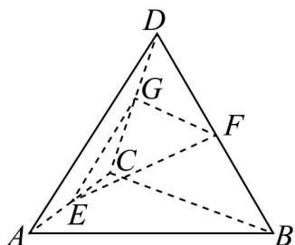

> [!faq]- 《专题8_4_空间点_直线_平面之间的位置关系_高效培优讲义_》官方解析
>
> > [!success]- **【答案】** D
>
> > [!note]- **【分析】**
> > 取 $CD$ 的中点 $G$ ，得到 $FG//BC,EG//AD$ ，得到 $\angle EGF$ 为异面直线 $AD$ 与 $BC$ 所成的角，在 $\triangle EFG$ 中
> >
> > $\cos\angle EGF=\frac{1}{2}$ ，即可得到答案：
>
> > [!note]- **【解析】**
> > 如图所示，取 $CD$ 的中点 $G$ ，连接 $EG$ ， $FG$ ，则 $FG//BC$ ， $EG//AD$
> >
> > 则 $\angle EGF$ 为异面直线 $AD$ 与 $BC$ 所成的角（或补角），
> >
> > 因为 $FG = \frac{1}{2} BC = 2$ ， $EG = \frac{1}{2} AD = 3$ ，所以 $\cos\angle EGF = \frac{4 + 9 - 7}{2 \times 2 \times 3} = \frac{1}{2}$
> >
> > 所以异面直线 $AD$ 与 $BC$ 所成角为 $\frac{\pi}{3}$
> >
> > 故选：D.
> >
> > 
