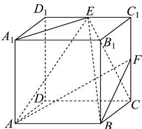
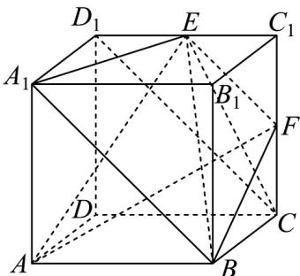
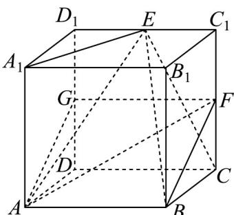

> [!faq]- 《专题8_4_空间点_直线_平面之间的位置关系_高效培优讲义_》官方解析
>
> > [!success]- **【答案】**  A. $A_{1}$ , E, F, B 四点共面 B. 直线 $AE$ 与直线 $BF$ 为异面直线 C. 该正方体的外接球和内切球的表面积之比为 $3\sqrt{3}:1$ D．三棱锥 E-ABC 的体积是三棱锥 F-ABC 的两倍
>
> > [!note]- **【分析】**
> > 对于 A，由 $EF // A_{1}B$ 可得四点共面；对于 B，由异面直线的定义判断即可；对于 C，根据正方体内切
> >
> > 球与外接球的特征及体积公式可判定；对于 $^{D}$ ，由三棱锥E-ABC的高是三棱锥F-ABC的高的两倍，可得
> >
> > 三棱锥 E-ABC 的体积是三棱锥 F-ABC 的两倍.
>
> > [!note]- **【解析】**
> > 对于 A，如图所示，连接 $A_{1}B, EF, D_{1}C$
> >
> > 
> >
> > 因为 $A_{1}D_{1} // BC, A_{1}D_{1} = BC$ ，则四边形 $A_{1}D_{1}CB$ 是平行四边形，
> >
> > 所以 $A_{1}B // D_{1}C$ ，又 E，F 分别为棱 $C_{1}D_{1}$ ， $C_{1}C$ 的中点，
> >
> > 所以 $EF / / D_{1}C$ ，则 $EF / / A_{1}B$
> >
> > 所以 $A_{1}$ ，E，F，B 四点共面，故 $\Lambda$ 正确；
> >
> > 对于 B，如图所示，
> >
> > 
> >
> > 取 $D_{1}D_{1}$ 的中点 G ，连接 AG, GF ，
> >
> > 则 $EF / / AB, EF = AB$ ，则四边形 $ABFG$ 是平行四边形，
> >
> > 所以 AG // BF，
> >
> > 因为 $AE \cap AG = A$ ，所以直线 AE 与直线 BF 为异面直线，故 B 正确；
> >
> > 对于 $^{C}$ ，根据正方体的特征可知其内切球直径为棱长，外接球直径为体对角线，
> >
> > 设正方体的棱长为 $^{1}$ ，则内切球的半径为 $\frac{1}{2}$ ，外接球的半径为 $\frac{\sqrt{3}}{2}$ ，
> >
> > 故外接球与内切球的表面积之比为 $\frac{4\pi\times\left(\frac{\sqrt{3}}{2}\right)^{2}}{4\pi\times\left(\frac{1}{2}\right)^{2}}=3:1$ ，故 C 错误；
> >
> > 对于 $^{D}$ ，根据正方体的特征与已知可知，点E到底面ABC的距离是点F到底面ABC的距离 $^{2}$ 倍，
> >
> > 即三棱锥 $E - ABC$ 的高是三棱锥 $F - ABC$ 的高的两倍，由两个三棱锥的底面积相等，
> >
> > 所以三棱锥 E-ABC 的体积是三棱锥 F-ABC 的体积两倍，故 D 正确.
> >
> > 故选 **ABD**.
