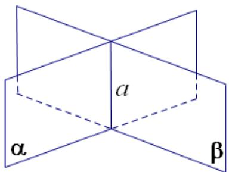

## 知识点 01 平面的基本概念

1、平面的概念：“平面”是一个只描述而不定义的原始概念，常见的桌面、黑板面、平静的水面等都给我们以

平面的形象．几何里的平面就是从这些物体中抽象出来的，但是，几何里的平面是无限延展的．

## 知识点诠释：

(1) “平面”是平的（这是区别“平面”与“曲面”的依据）；

(2) “平面”无厚薄之分；

(3) “平面”无边界，它可以向四周无限延展，这是区别“平面”与“平面图形”的依据。

2、平面的画法：

通常画平行四边形表示平面.

知识点诠释：

（1）表示平面的平行四边形，通常把它的锐角画成 $45^{\circ}$ ，横边长是其邻边的两倍；

(2) 两个相交平面的画法：当一个平面的一部分被另一个平面遮住时，把被遮住的部分的线段画为虚线或者

不画；

3、平面的表示法：

(1) 用一个希腊字母表示一个平面，如平面 $\alpha$ 、平面 $\beta$ 、平面 $\gamma$ 等；

（2）用表示平面的平行四边形的四个字母表示，如平面 $ABCD$ ；

（3）用表示平面的平行四边形的相对两个顶点的两个字母表示，如平面 $AC$ 或者平面 $BD$ ；

4、点、直线、平面的位置关系：

（1）点 $A$ 在直线 $a$ 上，记作 $A \in a$ ；点 $A$ 在直线 $a$ 外，记作 $A \notin a$ ；

(2) 点 A 在平面 $\alpha$ 上，记作 $A \in \alpha$ ；点 A 在平面 $\alpha$ 外，记作 $A \notin \alpha$ ；

(3) 直线 $l$ 在平面 $\alpha$ 内，记作 $l \subset \alpha$ ；直线 $l$ 不在平面 $\alpha$ 内，记作 $l \notin \alpha$ 。

【即学即练】

1. 已知点 $P$ 在直线 $l$ 上，直线 $l$ 在平面 $\alpha$ 内，但不在平面 $\beta$ 内，下列符号表示点、线、面的关系正确的是（）A. $P \subset l$ B. $P \subset \alpha$ C. $l \subset \alpha$ D. $l \notin \beta$

【答案】C
【分析】根据点、线、面位置关系的表示方法进行判断即可·
【详解】因为点 $P$ 在直线 $l$ 上可表示为 $P \in l$ ，故A错误；
直线 $l$ 在平面 $\alpha$ 内，可表示为 $l \subset \alpha$ ，故C正确；
因为 $P \in l$ ， $l \subset \alpha$ ，所以 $P \in \alpha$ ，故B错误；
直线 $l$ 不在平面 $\beta$ 内，可表示为 $l \notin \beta$ ，故D错误·

故选：C

2. 用符号语言表述“若直线 $l$ 在平面 $\alpha$ 内，则直线 $l$ 上的一点 $A$ 必在平面 $\alpha$ 内”，正确的是（） $\left.\begin{array}{l}l\subset\alpha\\A.A\in l\end{array}\right\}\Rightarrow A\in\alpha\quad\left.\begin{array}{l}l\in\alpha\\B.A\in l\end{array}\right\}\Rightarrow A\subset\alpha$ $\left.\begin{array}{l}l\subset\alpha\\C.A\subset l\end{array}\right\}\Rightarrow A\subset\alpha\quad\left.\begin{array}{l}l\in\alpha\\D.A\subset l\end{array}\right\}\Rightarrow A\in\alpha$

【答案】A

【分析】根据给定条件，利用点与线、线与面、点与面的关系的集合表示，逐项判断·

【详解】由直线 $l$ 在平面 $\alpha$ 内，得 $l \subset \alpha$ ；由点 $A$ 在直线 $l$ 上，得 $A \in l$ ；由点 $A$ 在平面 $\alpha$ 内，得 $A \in \alpha$

选项 A 正确，选项 BCD 都错.

故选：A
