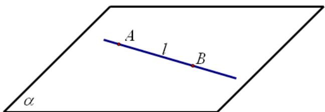
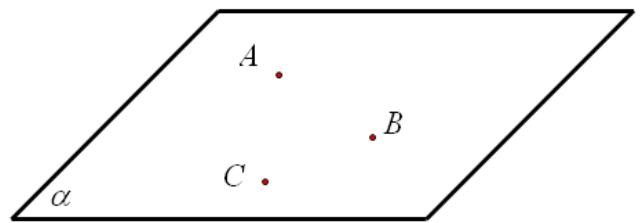
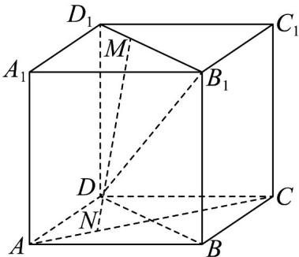
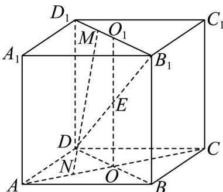

## 知识点 02 平面的基本性质

平面的基本性质即书中的三个公理，它们是研究立体几何的基本理论基础。

1、公理1：

（1）文字语言表述：如果一条直线上的两点在一个平面内，那么这条直线上所有的点都在这个平面内；

(2) 符号语言表述： $A \in l$ ， $B \in l$ ， $A \in \alpha$ ， $B \in \alpha \Rightarrow l \subset \alpha$ ；

(3) 图形语言表述：

知识点诠释：公理1是判断直线在平面内的依据．证明一条直线在某一平面内，只需证明这条直线上有两个

不同的点在该平面内．“直线在平面内”是指“直线上的所有点都在平面内”.

2、公理2：

（1）文字语言表述：过不在一条直线上的三点，有且只有一个平面；

(2) 符号语言表述：A、B、C三点不共线⇒有且只有一个平面α，使得 $A\in\alpha$ ， $B\in\alpha$ ， $C\in\alpha$ ；

(3) 图形语言表述：

知识点诠释：公理2的作用是确定平面，是把空间问题化归成平面问题的重要依据。它还可用来证明“两个平

面重合”. 特别要注意公理 2 中“不在一条直线上的三点”这一条件.

“有且只有一个”的含义可以分开来理解。“有”是说明“存在”，“只有一个”说明“唯一”，所以“有且只有一个”也可

以说成“存在”并且“唯一”，与确定同义。

(4) 公理 2 的推论：

①过一条直线和直线外一点，有且只有一个平面；

②过两条相交直线，有且只有一个平面；

③过两条平行直线，有且只有一个平面。

(5) 作用：确定一个平面的依据。

3、公理3：

(1) 文字语言表述：如果两个不重合的平面有一个公共点，那么它们有且只有一条过该点的公共直线；

(2) 符号语言表述： $P \in \alpha \cap \beta \Rightarrow \alpha \cap \beta = l$ 且 $P \in l$ ;

(3) 图形语言表述：

知识点诠释：公理3的作用是判定两个平面相交及证明点在直线上的依据.

【即学即练】

1. 已知空间有 $6$ 个不同的平面，则它们的交线条数最多为（）

【答案】
A. 15    B. 16    C. 17    D. 18

【答案】A

【分析】先分析出当这 $^{6}$ 个平面任意 $^{2}$ 个都相交，且交线不重合时，交线最多，再分步计算有多少条交线即

可·

【详解】当这 $^{6}$ 个平面任意 $^{2}$ 个都相交，且交线不重合时，交线最多，

记这 $^{6}$ 个不同的平面分别为 $\alpha_{i}(i=1,2,3,4,5,6)$

此时 $\alpha_{1}$ 与其余 $^{5}$ 个平面相交，有 $^{5}$ 条交线， $\alpha_{2}$ 与除去 $\alpha_{1}$ 外的 $^{4}$ 个平面相交有 $^{4}$ 条交线， $\mathsf{L}$ ， $\alpha_{5}$ 与 $\alpha_{6}$ 相交有

1条交线，

所以共有 $5+4+3+2+1=15$ 条交线.

故选：A.

2. 已知正方体 $ABCD - A_{1}B_{1}C_{1}D_{1}$ 中，点 $M$ 为线段 $D_{1}B_{1}$ 上的动点，点 $N$ 为线段 $AC$ 上的动点，则与线段 $DB_{1}$ 相交且互相平分的线段 $MN$ 有 \_\_\_\_ 备：

交且互相平分的线段 $MN$ 有 \_\_\_\_ 条·

【答案】 $^{1}$

【分析】根据给定条件，利用平面的基本事实确定点 $N$ 的位置，再作图确定 $M$ 的位置作答

【详解】在正方体 $ABCD - A_{1}B_{1}C_{1}D_{1}$ 中， $M \in D_{1}B_{1}$ ，而 $D_{1}B_{1} \subset$ 平面 $D_{1}B_{1}D$ ，即有 $M \in$ 平面 $D_{1}B_{1}D$

又 $MN$ 与线段 $DB_{1}$ 相交，则交点必在直线 $DB_{1}$ 上，而 $DB_{1} \subset$ 平面 $D_{1}B_{1}D$ ，于是 $MN \subset$ 平面 $D_{1}B_{1}D$ ， $N \in$ 平面 $D_{1}B_{1}D$

而 $N \in AC$ ， $AC \subset$ 平面 $ABCD$ ，即 $N \in$ 平面 $ABCD$ ，而平面 $D_{1}B_{1}D \cap$ 平面 $ABCD = BD$

因此 $N \in BD$ ，即点 $N$ 为 $AC, BD$ 的交点 $O$ ，又线段 $DB_{1}$ 与 $MN$ 互相平分，

取 $DB_{1}$ 的中点 $E$ ，连接 $OE$ 并延长交 $D_{1}B_{1}$ 于 $O_{1}$ ，显然 $EO //BB_{1} //DD_{1}$ ，于是 $O_{1}$ 为 $D_{1}B_{1}$ 的中点，

所以当点 N 与 O 重合，点 M 与 $O_{1}$ 重合时，MN 与线段 $DB_{1}$ 相交且互相平分，这样的直线 MN 只有 $^{1}$ 条·

故答案为：1
