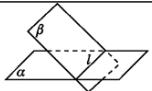

## 知识点 07 平面与平面的位置关系

<table><tr><td>位置关系</td><td>图形表示</td><td>符号表示</td><td>公共点</td></tr><tr><td>两平面平行</td><td></td><td>α//β</td><td>无公共点</td></tr><tr><td>两平面相交</td><td></td><td>α∩β=l</td><td>有无数个公共点,这些点在一条直线上</td></tr></table>
