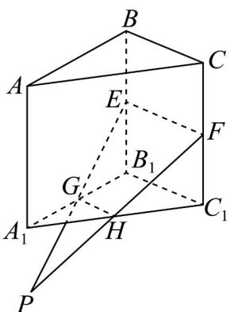

> [!faq]- 《专题8_4_空间点_直线_平面之间的位置关系_高效培优讲义_》官方解析
>
> > [!success]- **【答案】** ABC
>
> > [!note]- **【分析】**
> > 利用线线平行的传递性与平面公理的推论即可判断 $^{AB}$ ；利用平面公理判断得EG，FH的交点P在 $AA_{1}$ ，从而可判断C；举反例即可判断D.
>
> > [!note]- **【解析】**
> > 对于 $AB$ ，如图，连接 $EF$ ，GH
> >
> > 
> >
> > 因为 $GH$ 是 $\triangle A_{1}B_{1}C_{1}$ 的中位线，所以 $GH // B_{1}C_{1}$
> >
> > 因为 $B_{1}E \parallel C_{1}F$ ，且 $B_{1}E = C_{1}F$ ，所以四边形 $B_{1}EFC_{1}$ 是平行四边形，
> >
> > 所以 $EF//B_{1}C_{1}$ ，所以 $EF//GH$ ，所以 E, F, G, H 四点共面，AB 正确；
> >
> > 对于 $^{C}$ ，如图，延长EG，FH相交于点P，
> >
> > 因为 $P \in EG$ ， $EG \subset \text{平面} ABB_{1}A_{1}$ ，所以 $P \in \text{平面} ABB_{1}A_{1}$ ，
> >
> > 因为 $P \in FH$ ， $FH \subset$ 平面 $ACC_{1}A_{1}$ ，所以 $P \in$ 平面 $ACC_{1}A_{1}$ ，
> >
> > 因为平面 $ABB_{1}A_{1} \cap$ 平面 $ACC_{1}A_{1} = AA_{1}$
> >
> > 所以 $P \in AA_{1}$ ，所以 EG, FH, $AA_{1}$ 三线共点，C 正确；
> >
> > 对于D，因为 $EB_{1} = FC_{1}$ ，当 $GB_{1}\neq HC_{1}$ 时， $\tan \angle EGB_1\neq \tan \angle FHC_1$
> >
> > 又 $0 < \angle EGB_{1}, \angle FHC_{1} < \frac{\pi}{2}$ ，则 $\angle EGB_{1} \neq \angle FHC_{1}$ ，D 错误.
> >
> > 故选 **ABC**
