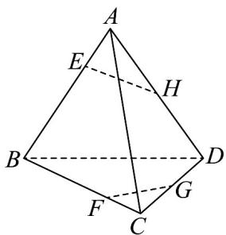
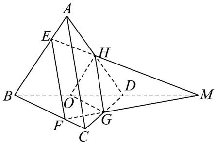

## 题型02 点线共面

【典例1】在四面体ABCD中，H、G分别是AD、CD的中点，点E、F分别是AB、BC边上的点，且

$$
\frac {B F}{F C} = \frac {B E}{E A} = k (k > 0)
$$

(1)求证： $E$ 、 $F$ 、 $G$ 、 $H$ 四点共面；

(2)若四面体 $ABCD$ 为棱长为 $6$ 的正四面体，且 $k = 2$ ，求四边形 $EFGH$ 的周长；

(3)若平面 $EFGH$ 截四面体 $ABCD$ 所得的五面体 $AC - EFGH$ 的体积占四面体 $ABCD$ 的 $\frac{3}{25}$ ，求 $k$ 的值。

【答案】 $^{(1)}$ 证明见解析

(2) $2\sqrt{7}+7$

(3) $k = 9$

【分析】（1）利用平行的传递性证明 $EF / / HG$ 即可；

(2) 由余弦定理及线段成比例即可求解；

(3) 延长 $EH, FG, BD$ ，则必交于点 $M$ ，利用相似比求解即可.

【详解】（1）连接 $EF, HG$

因为 $H$ 、 $G$ 分别是 $AD$ 、 $CD$ 的中点，

所以 $AC \parallel HG$

又 $\frac{BF}{FC} = \frac{BE}{EA} = k(k > 0)$

所以 AC // EF，

所以 EF // HG，

所以 $E$ 、 $F$ 、 $G$ 、 $H$ 四点共面；

(2) $\frac{BF}{FC} = \frac{BE}{EA} = 2$

$E,F$ 为三等分点，又 $H$ 是 $AD$ 中点，

所以 AE = 2, AH = 3

由余弦定理可得： $EH^{2}=AE^{2}+AH^{2}-2AE\cdot AH\cos60^{\circ}=7$

得： $EH = \sqrt{7}$ ，同理 $FG = \sqrt{7}$

$\frac{EF}{AC} = \frac{2}{3}$ ， $H$ 、 $G$ 分别是 $AD$ 、 $CD$ 的中点，

所以 $EF = 4$ ， $HG = 3$

所以四边形 EFGH 的周长 $2\sqrt{7} + 7$ .

(3) 延长 $EH, FG, BD$ ，则必交于点 $M$ ，

证明如下：设 $EH \cap FG = M$

因为 $EH \subset$ 平面 ABD ，

所以 $M \in$ 平面 ABD ，

同理 $M \in$ 平面 BCD ，

又平面 $ABD \cap$ 平面 $BCD = BD$

所以 $M \in BD$ ，

所以 $EH, FG, BD$ ，则必交于点 $M$

取 BD 的中点 O，连接 OH,OG

因为 $\frac{BE}{EA} = k(k > 0)$

所以 $\frac{BE}{BA} = \frac{k}{k + 1}$

又 $\frac{OH}{BA} = \frac{1}{2}$

所以 $\frac{OH}{BE} = \frac{k + 1}{2k}$

所以 $\frac{V_{M - HOG}}{V_{M - EBF}} = \left(\frac{k + 1}{2k}\right)^3$

$$
\frac {M O}{M B} = \frac {O H}{B E} = \frac {k + 1}{2 k}
$$

所以 $\frac{MD + DO}{MD + 2DO} = \frac{k + 1}{2k}$

所以 $2kMD + 2kDO = (k + 1)MD + 2(k + 1)DO$

所以 $(k-1)MD=2DO$ ，即 $\frac{MD}{DO}=\frac{2}{k-1}$ ，

所以 $V_{M-HDG} = \frac{2}{k-1} V_{D-HOG}$ ， $V_{M-HOG} = \frac{k+1}{k-1} V_{D-HOG}$ ，

所以 $V_{M-EBF}=\frac{8k^{3}}{(k+1)^{3}}\cdot V_{M-HOG}=\frac{8k^{3}}{(k+1)^{3}}\cdot\frac{k+1}{k-1}\cdot V_{D-HOG}$

$$
V _ {H O G - E B F} = \left(\frac {8 k ^ {3}}{(k + 1) ^ {3}} \cdot \frac {k + 1}{k - 1} - \frac {k + 1}{k - 1}\right) \cdot V _ {D - H O G} = \left(\frac {8 k ^ {3}}{(k + 1) ^ {3}} \cdot \frac {k + 1}{k - 1} - \frac {k + 1}{k - 1}\right) \cdot \frac {1}{8} V _ {A - B C D}
$$

$$
= \left(\frac {2 2}{2 5} - \frac {1}{8}\right) \cdot V _ {A - B C D}
$$

所以 $\left(\frac{8k^3}{(k + 1)^3} -1\right)\frac{k + 1}{k - 1}\cdot \frac{1}{8} = \frac{22}{25} -\frac{1}{8}$ ，即 $\frac{8k^3 - (k + 1)^3}{(k + 1)^2}\cdot \frac{1}{k - 1} = \frac{151}{25}$

所以 $\frac{7k^{2}+4k+1}{k^{2}+2k+1}=\frac{151}{25}$ ，即 $12k^{2}-101k-63=0$ ，

所以 $(12k + 7)(k - 9) = 0$

解得 $k = 9$ 或 $k = -\frac{7}{12}$

又因为 $k > 0$ ，所以 $k = 9$

方法技巧

证明点线共面问题的常用方法

(1) 纳入法：先由部分直线确定一个平面，再证明其他直线在这个平面内。

(2) 重合法：先说明一些直线在一个平面内，另一些直线在另一个平面内，再证明两个平面重合.

![[高中/课堂同步/题库/人教A版高中数学同步讲义(2026)/02_必修第二册/第八章 立体几何初步/讲义/专题8_4_空间点_直线_平面之间的位置关系_高效培优讲义_/题型02_点线共面_sec_13/questions/Q00065176.md]]
![[高中/课堂同步/题库/人教A版高中数学同步讲义(2026)/02_必修第二册/第八章 立体几何初步/讲义/专题8_4_空间点_直线_平面之间的位置关系_高效培优讲义_/题型02_点线共面_sec_13/questions/Q00065177.md]]
![[高中/课堂同步/题库/人教A版高中数学同步讲义(2026)/02_必修第二册/第八章 立体几何初步/讲义/专题8_4_空间点_直线_平面之间的位置关系_高效培优讲义_/题型02_点线共面_sec_13/questions/Q00065178.md]]
