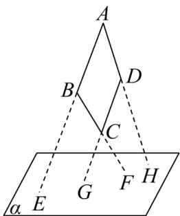

<!-- question-source:start -->
【变式3】如图所示，四边形ABCD中，已知 $AB\parallel CD$ ，AB，BC，DC，AD(或延长线)分别与平面 $\alpha$ 相交于 $E$

$F, G, H$ ，求证： $E, F, G, H$ 必在同一直线上。

<!-- question-source:end -->

![[高中/课堂同步/题库/人教A版高中数学同步讲义(2026)/02_必修第二册/第八章 立体几何初步/讲义/专题8_4_空间点_直线_平面之间的位置关系_高效培优讲义_/题型03_三点共线_sec_14/questions/answers/Q00065181A1.md]]
