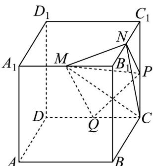

<!-- question-source:start -->
【变式2】如图，在长方体 $ABCD - A_{1}B_{1}C_{1}D_{1}$ 中， $AB = BC = 4$ ， $AA_{1} = 3$ ，点 $M, N, P$ ， $Q$ 分别是棱 $A_{1}B_{1}, B_{1}C_{1}, CC_{1}, CD$ 的中点．

(1)证明：三条直线 $MN, QP, D_1C_1$ 相交于同一点

(2)求三棱锥 C-MNP 的体积.
<!-- question-source:end -->

![[高中/课堂同步/题库/人教A版高中数学同步讲义(2026)/02_必修第二册/第八章 立体几何初步/讲义/专题8_4_空间点_直线_平面之间的位置关系_高效培优讲义_/题型03_三点共线_sec_14/questions/answers/Q00065183A1.md]]
