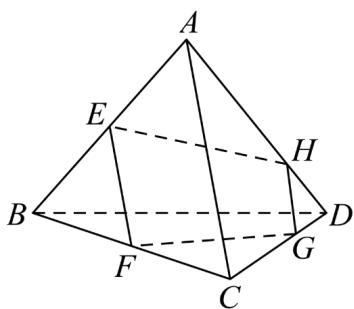

<!-- question-source:start -->
【变式3】如图，已知空间四边形 $ABCD$ ， $E$ ， $F$ 分别是 $AB$ ， $BC$ 的中点， $G$ ， $H$ 分别在 $CD$ 和 $AD$ 上，且满足

$\frac{CG}{GD} = \frac{AH}{HD} = 2$ 求证：

(1) $E, F, G, H$ 四点共面；

(2) $EH$ ，FG，BD三线共点.
<!-- question-source:end -->

![[高中/课堂同步/题库/人教A版高中数学同步讲义(2026)/02_必修第二册/第八章 立体几何初步/讲义/专题8_4_空间点_直线_平面之间的位置关系_高效培优讲义_/题型03_三点共线_sec_14/questions/answers/Q00065184A1.md]]
