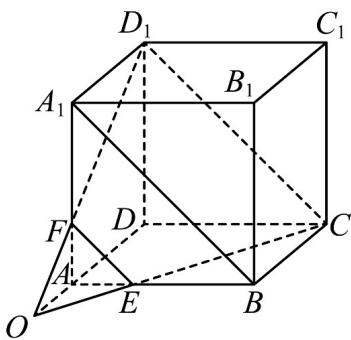

> [!faq]- 《专题8_4_空间点_直线_平面之间的位置关系_高效培优讲义_》官方解析
>
> > [!success]- **【答案】** (1)证明见祥解 (2)证明见祥解
>
> > [!note]- **【分析】**
> > （1）连接 $EF, A_1B, D_1C$ ，利用中位线定理得到 $EF \parallel A_1B$ ，再根据正方体的性质得到 $BC \parallel A_1D_1$ ，进
> >
> > 而证明四边形 $BCD_{1}A_{1}$ 是平行四边形，从而得到 $EF\parallel D_{1}C$ ，由此可证 $E,C,D_{1},F$ 四点共面；
> >
> > (2) 先证 $O \in$ 平面 $ADD_{1}A_{1}$ ，且 $O \in$ 平面 $ABCD$ ，又平面 $ADD_{1}A_{1} \cap$ 平面 $ABCD = AD$
> >
> > 所以 $O \hat{I} AD$ ，进而得到 A，O，D 三点共线。
>
> > [!note]- **【解析】**
> > （1）证明：如图，连接 $EF, A_{1}B, D_{1}C$ 。
> >
> > 
> >
> > 在正方体 $ABCD - A_{1}B_{1}C_{1}D_{1}$ 中， $A_{1}F = 2FA, BE = 2AE$ ，所以 $EF \parallel A_{1}B$
> >
> > 又 $BC\parallel A_1D_1$ ，且 $BC = A_{1}D_{1}$
> >
> > 所以四边形 $BCD_{1}A_{1}$ 是平行四边形，所以 $A_{1}B \parallel D_{1}C$
> >
> > $\therefore EF \parallel D_{1}C$ ，所以 $E, C, D_{1}, F$ 四点共面；
> >
> > (2) 证明：由 $D_{1}F \cap CE = O$ ， $\therefore O \in D_{1}F$ ，又 $D_{1}F \subset$ 平面 $ADD_{1}A_{1}$ ， $\therefore O \in$ 平面 $ADD_{1}A_{1}$
> >
> > 同理 $O \in$ 平面 ABCD，又平面 $ADD_{1}A_{1} \cap$ 平面 ABCD = AD，
> >
> > $\therefore O \in AD$ ，即 $A, O, D$ 三点共线·
