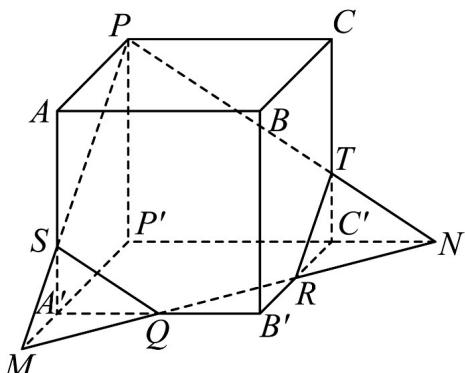
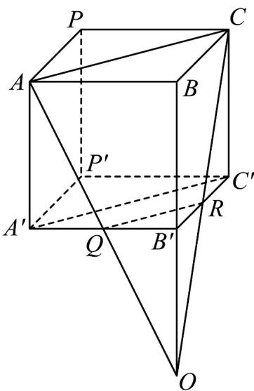

> [!faq]- 《专题8_4_空间点_直线_平面之间的位置关系_高效培优讲义_》官方解析
>
> > [!success]- **【答案】** (1)图象见解析； (2)证明见解析·
>
> > [!note]- **【分析】**
> > （ $^{1}$ ）根据给定条件，利用平面的基本性质作图·
> >
> > (2) 证明四边形 $AQRC$ 为梯形，设 $AQ \cap CR = O$ ，再证明 $O \in BB'$ ，即可得到 $AQ, CR, BB'$ 三线共点。
>
> > [!note]- **【解析】**
> > （1）作直线 $QR$ 分别交 $P'A', P'C'$ 的延长线于 $M, N$ ，连接 $MP$ 交 $AA'$ 于 $S$ ，
> >
> > 连接 $PN$ 交 $CC'$ 于点 $T$ ，连接 $SQ,TR$ ，则五边形 $PSQRT$ 即为所求，如图：
> >
> > 
> >
> > (2) 如图，连接 $QR$ ， $AC$ ， $A'C'$ ，四边形 $ACC'A'$ 是正四棱柱 $ABCP - A'B'C'P'$ 的对角面，则 $AC = A'C'$
> >
> > $$
> > A C / / A ^ {\prime} C ^ {\prime}
> > $$
> >
> > 
> >
> > 由 $Q$ 、 $R$ 分别为 $A'B'$ 、 $B'C'$ 中点，得 $QR // A'C', A'C' = 2QR$ ，则 $QR // AC$ ，且 $AC = 2QR$ ，即四边形 $AQRC$ 为梯形，令 $AQ \cap CR = O$ ，则 $O \in AQ$ ，而 $AQ \subset$ 平面 $A'AB$ ，则 $O \in$ 平面 $A'AB$ ，同理 $O \in$ 平面 $C'CB$ ，又平面 $A'AB \cap$ 平面 $C'CB = BB'$ ，因此 $O \in BB'$ ，所以 $AQ, CR, BB'$ 三线共点：
