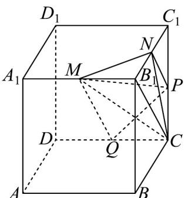

> [!faq]- 《专题8_4_空间点_直线_平面之间的位置关系_高效培优讲义_》官方解析
>
> > [!success]- **【答案】** (1)证明见解析； (2)1.
>
> > [!note]- **【分析】**
> > （1）先通过证明 $PN \parallel QM$ 且 $PN \neq QM$ 得到 $M, N, P, Q$ 四点共面，且 $MN, QP$ 相交，再利用基本事
> >
> > 实三可证明结论；
> >
> > (2) 通过 $V_{\text{三棱锥}C-MNP} = V_{\text{三棱锥}M-NPC}$ 以及棱锥的体积公式求解.
>
> > [!note]- **【解析】**
> > （1）连接 $B_{1}C$ ，如图：
> >
> > ∵ M, Q 分别是 $A_{1}B_{1}, CD$ 的中点， $A_{1}B_{1} \parallel CD$ ， $A_{1}B_{1} = CD$
> >
> > $\therefore QC \parallel MB_{1}$ 且 $QC = MB_{1}$
> >
> > ∴四边形 $B_{1}CQM$ 为平行四边形，∴ $B_{1}C\parallel QM$ ，
> >
> > 在 $\triangle B_{1}C_{1}C$ 中， $\because P, N$ 分别是 $CC_{1}, B_{1}C_{1}$ 的中点， $\therefore PN \parallel B_{1}C$ ， $\therefore PN \parallel QM$
> >
> > 且 $PN = \frac{1}{2} QM$ $\therefore M, N, P, Q$ 四点共面，
> >
> > 设 $MN \cap QP = H$ ， $\because MN \subset \text{平面 } A_1B_1C_1D_1$ ， $QP \subset \text{平面 } DCC_1D_1$ ， $\therefore H \in \text{平面 } A_1B_1C_1D_1$ ， $H \in \text{平面 } DCC_1D_1$
> >
> > $\because$ 平面 $A_{1}B_{1}C_{1}D_{1}\cap DCC_{1}D_{1}=C_{1}D_{1},\therefore H\in C_{1}D_{1}$
> >
> > 三条直线 $MN, QP, D_{1}C_{1}$ 相交于同一点 $H$ ；
> >
> > 
> >
> > (2) $V_{\text{三棱锥}C - MNP} = V_{\text{三棱锥}M - NPC}$ ，三棱锥 $M - NPC$ 的高为 $MB_{1}$ ，
> >
> > ∵ 点 M 是棱 $A_{1}B_{1}$ 的中点， $A_{1}B_{1}=4\therefore MB_{1}=2$
> >
> > ∵ 点 N, P 分别是棱 $B_{1}C_{1}, CC_{1}$ 的中点， $B_{1}C_{1}=4$ ， $CC_{1}=3$
> >
> > $$
> > \therefore S _ {\triangle N P C} = \frac {1}{2} \times C P \times C _ {1} N = \frac {1}{2} \times \frac {1}{2} C C _ {1} \times \frac {1}{2} B C = \frac {1}{2} \times \frac {1}{2} \times 3 \times 2 = \frac {3}{2}
> > $$
> >
> > $$
> > \therefore V _ {\text {三棱锥} C - M N P} = V _ {\text {三棱锥} M - N P C} = \frac {1}{3} S _ {\triangle N P C} \times M B _ {1} = \frac {1}{3} \times \frac {3}{2} \times 2 = 1.
> > $$
