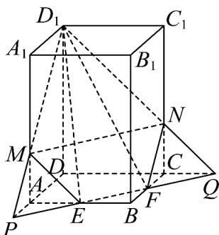

> [!faq]- 《专题8_4_空间点_直线_平面之间的位置关系_高效培优讲义_》官方解析
>
> > [!success]- **【答案】** A. $8\sqrt{3}$ B. $4\sqrt{3}$ C. $\frac{7\sqrt{3}}{2}$ D. $7\sqrt{3}$
>
> > [!note]- **【解析】**
> > 设设直线 EF 分别交 DA, DC 的延长线于点 P, Q，连接 $D_{1}P$ ，交 $AA_{1}$ 于点 M
> >
> > 连接 $D_{1}Q$ ，交 $CC_{1}$ 于点N，连接ME,FN
> >
> > $$
> > D _ {1}, E, F
> > $$
> >
> > $$
> > A B C D - A _ {1} B _ {1} C _ {1} D _ {1}
> > $$
> >
> > $$
> > D _ {1} M E F N
> > $$
> >
> > $$
> > D P = D D _ {1} = 3 \sqrt {2}
> > $$
> >
> > $$
> > A P = B F = \sqrt {2}
> > $$
> >
> > $$
> > \triangle D D _ {1} P
> > $$
> >
> > $$
> > A M = A P = \sqrt {2}
> > $$
> >
> > 故 $A_{1}M = 2\sqrt{2}$ ，则 $D_{1}M = D_{1}N = 4$ ， $ME = EF = FN = 2$
> >
> > 连接MN，易知MN=4，
> >
> > 所以五边形 $D_{1}MEFN$ 可以分成等边三角形 $D_{1}MN$ 和等腰梯形 $MEFN$ 两部分，
> >
> > 等腰梯形MEFN的高 $h = \sqrt{2^2 - \left(\frac{4 - 2}{2}\right)^2} = \sqrt{3}$
> >
> > 则等腰梯形MEFN的面积为 $\frac{4 + 2}{2}\times \sqrt{3} = 3\sqrt{3}$
> >
> > 又 $S_{\triangle D_1MN} = \frac{\sqrt{3}}{4}\times 4^2 = 4\sqrt{3}$
> >
> > 所以五边形的面积为 $3\sqrt{3} + 4\sqrt{3} = 7\sqrt{3}$ .
> >
> > 
> >
> > 故选 **D**.
