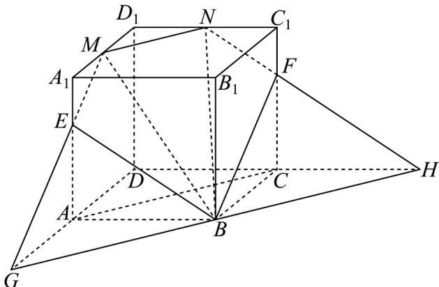

> [!faq]- 《专题8_4_空间点_直线_平面之间的位置关系_高效培优讲义_》官方解析
>
> > [!success]- **【答案】** $6\sqrt{13} + 3\sqrt{2}$
>
> > [!note]- **【分析】**
> > 作出辅助线，得到过点 M, N, B 的平面截该正方体的截面为五边形 BEMNF，并求出周长·
>
> > [!note]- **【解析】**
> > 因为 M，N 分别为棱 $A_{1}D_{1}$ ， $C_{1}D_{1}$ 的中点，所以 $A_{1}C_{1} // MN$
> >
> > 过点 B 作 GH // AC 交 DA 的延长线于点 G ，交 DC 的延长线于点 H ，
> >
> > 连接 $GM$ 交 $AA_{1}$ 于点 $E$ ，连接 $NH$ 交 $CC_{1}$ 于点 $F$ ，
> >
> > 因为 $A_{1}C_{1} / / AC$ ，则 $A_{1}C_{1} / / GH$ ，且 $E,F$ 分别是 $AA_{1},CC_{1}$ 的三等分点，
> >
> > 故过点 B, M, N 的平面截该正方体所得截面为五边形 BEMNF，
> >
> > 由勾股定理得 $ME = NF = \sqrt{3^2 + 2^2} = \sqrt{13}$ ， $BE = BF = \sqrt{4^2 + 6^2} = 2\sqrt{13}$ ， $MN = \sqrt{3^2 + 3^2} = 3\sqrt{2}$ ，
> >
> > 故五边形 BEMNF 的周长为 $2 \times \sqrt{13} + 2 \times 2\sqrt{13} + 3\sqrt{2} = 6\sqrt{13} + 3\sqrt{2}$ .
> >
> > 故答案为： $6\sqrt{13}+3\sqrt{2}$
> >
> > 
