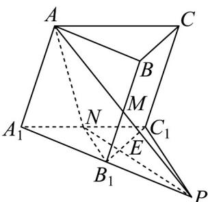

## 题型05 截面问题

【典例1】已知三棱柱 $ABC - A_{1}B_{1}C_{1}$ 中， $M, N$ 分别为棱 $BB_{1}, A_{1}C_{1}$ 的中点，过 $A, M, N$ 作三棱柱的截面交 $B_{1}C_{1}$ 于 $E$ 点，且 $B_{1}E = 2$ ，则 $B_{1}C_{1} =$ \_\_\_\_.

【答案】6

【分析】连接 AM 并延长与 $A_{1}B_{1}$ 的延长线交于点 P，连接 NP 与直线 $B_{1}C_{1}$ 相交，即为点 E，首先证明 $B_{1}$ 是 $A_{1}P$

$NB_{1} // C_{1}P, NB_{1} = \frac{1}{2} C_{1}P$ 的中点，推出 $B_{1}C_{1} = 3B_{1}E$ ，即可利用三角形相似推出

【详解】连接 AM 并延长与 $A_{1}B_{1}$ 的延长线交于点 P，连接 NP 与直线 $B_{1}C_{1}$ 相交交点即为点 E，

因为 AM 与 NE 相交于点 P，所以 A, M, N、E 四点共面，

因为 M 是 $BB_{1}$ 的中点，且 $AA_{1} = BB_{1}$ 、 $AA_{1} // BB_{1}$ ，所以 $MB_{1} = \frac{1}{2} AA_{1}$ ， $MB_{1} // AA_{1}$ ，

所以 $MB_{1}$ 是 $\triangle AA_{1}P$ 的中位线，则 $B_{1}$ 是 $A_{1}P$ 的中点，

又因为 N 为 $A_{1}C_{1}$ 的中点，所以 $NB_{1} // C_{1}P$ 、 $NB_{1} = \frac{1}{2}C_{1}P$ ，

易知 $\triangle NEB_{1} \sim \triangle PEC_{1}$ ，则 $\frac{B_{1}E}{EC_{1}} = \frac{NB_{1}}{C_{1}P} = \frac{1}{2}$ ，所以 $B_{1}C_{1} = 3B_{1}E = 6$ 。

故答案为：6

![[高中/课堂同步/题库/人教A版高中数学同步讲义(2026)/02_必修第二册/第八章 立体几何初步/讲义/专题8_4_空间点_直线_平面之间的位置关系_高效培优讲义_/题型05_截面问题_sec_15/questions/Q00065185.md]]
![[高中/课堂同步/题库/人教A版高中数学同步讲义(2026)/02_必修第二册/第八章 立体几何初步/讲义/专题8_4_空间点_直线_平面之间的位置关系_高效培优讲义_/题型05_截面问题_sec_15/questions/Q00065186.md]]
![[高中/课堂同步/题库/人教A版高中数学同步讲义(2026)/02_必修第二册/第八章 立体几何初步/讲义/专题8_4_空间点_直线_平面之间的位置关系_高效培优讲义_/题型05_截面问题_sec_15/questions/Q00065187.md]]
