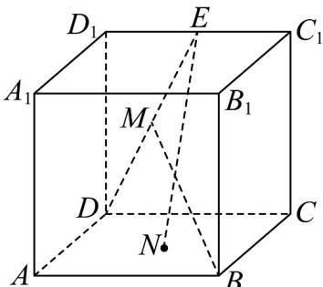

<!-- question-source:start -->
【变式1】如图，在正方体 $ABCD - A_{1}B_{1}C_{1}D_{1}$ 中，点 $N$ 为正方形ABCD的中心， $E$ 为 $C_1D_1$ 中点， $M$ 是线段的中

点，则（）

A. $BM = EN$ 且直线 $BM, EN$ 是相交直线

B. $BM \neq EN$ 且直线 $BM, EN$ 是相交直线

C. BM = EN 且直线 BM, EN 是异面直线

D. $BM \neq EN$ 且直线 $BM, EN$ 是异面直线
<!-- question-source:end -->

![[高中/课堂同步/题库/人教A版高中数学同步讲义(2026)/02_必修第二册/第八章 立体几何初步/讲义/专题8_4_空间点_直线_平面之间的位置关系_高效培优讲义_/题型06_直线与直线的位置关系_sec_16/questions/answers/Q00065188A1.md]]
