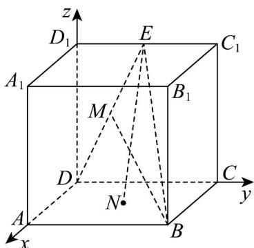

> [!faq]- 《专题8_4_空间点_直线_平面之间的位置关系_高效培优讲义_》官方解析
>
> > [!success]- **【答案】** B
>
> > [!note]- **【分析】**
> > 建立空间直角坐标系，写出点坐标，利用坐标法可求边长，连接 $BD, BE$ 即可判断两直线的位置关系·
>
> > [!note]- **【解析】**
> > 设正方体的棱长为 $^{2}$ ，以D为原点，分别以 $DA, DC, DD_{1}$ 所在直线分别为x，y，z轴，建立空间直角
> >
> > 坐标系，
> >
> > 
> >
> > 则 $B(2,2,0), N(1,1,0), E(0,1,2), D(0,0,0)$
> >
> > 因为 M 是线段 ED 的中点，可得 $M\left(0,\frac{1}{2},1\right)$
> >
> > 所以 $\square \square \square \square = BM = (-2, -\frac{3}{2}, 1), EN = (1, 0, -2)$
> >
> > $$
> > \left| \overrightarrow {B M} \right| = \sqrt {(- 2) ^ {2} + (- \frac {3}{2}) ^ {2} + 1 ^ {2}} = \frac {\sqrt {2 9}}{2}
> > $$
> >
> > $$
> > \left| \stackrel {\square \sqcup \sqcup} {E N} \right| = \sqrt {1 ^ {2} + 0 ^ {2} + (- 2) ^ {2}} = \sqrt {5}
> > $$
> >
> > 所以 $BM \neq EN$ ，
> >
> > 连接 $BD, BE$ ，易知 $BM \subset$ 平面 $BDE$ ， $EN \subset$ 平面 $BDE$ ，
> >
> > 所以 $BM \neq EN$ 且直线 BM, EN 是相交直线.
> >
> > 故选 **B**.
