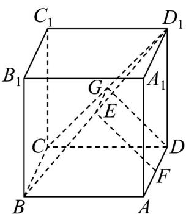

> [!faq]- 《专题8_4_空间点_直线_平面之间的位置关系_高效培优讲义_》官方解析
>
> > [!success]- **【答案】** 证明见解析
>
> > [!note]- **【分析】**
> > 取 $CD_{1}$ 的中点 $G$ ，连接 $EG$ ， $DG$ ，由三角形中位线定理以及平行四边形的性质可证明 $EF / / C_1D$
> >
> > 可得直线 $D_{1}C$ 与 $CD_{1}$ 所成的角即为异面直线 $CD_{1}$ 与 $EF$ 所成的角，求出为直角即可
>
> > [!note]- **【解析】**
> > 如图，取 $CD_{1}$ 的中点 G，
> >
> > 
> >
> > 连接 $EG$ ，DG·
> >
> > ∵E 是 $BD_{1}$ 的中点，
> >
> > $\therefore EG^{\parallel}BC, EG = \frac{1}{2} BC \because F$ 是 $AD$ 的中点，且 $AD^{\parallel}BC, AD = BC$
> >
> > $$
> > \therefore D F ^ {\parallel} B C, D F = \frac {1}{2} B C,
> > $$
> >
> > $\therefore EG^{\parallel}DF, EG = DF, \therefore$ 四边形 $EFDG$ 是平行四边形，
> >
> > $\therefore EF^{\parallel}DG$
> >
> > $\therefore \angle DGD_{1}$ (或其补角)是异面直线 $CD_{1}$ 与 $EF$ 所成的角·
> >
> > 又∵ $A_{1}A=AB$ ，∴四边形 $ABB_{1}A_{1}$ 、四边形 $CDD_{1}C_{1}$ 都是正方形，又G为 $CD_{1}$ 的中点，∴ $DG\perp CD_{1}$
> >
> > $\therefore \angle D_{l}GD = 90^{\circ}$ ，∴异面直线 $CD_{l}$ 与 EF 所成的角为 $90^{\circ}$ .
> >
> > 所以 $CD_{1} \perp EF$ .
