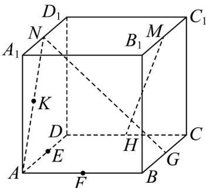
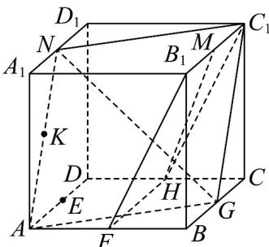

## 题型06 直线与直线的位置关系

【典例1】如图，正方体 $ABCD - A_1B_1C_1D_1$ 中， $E, F, G, H, M, N$ 分别为棱 $AD, AB, BC, CD$ ， $B_1C_1, A_1D_1$ 的中点， $K$ 为 $AN$ 的中点，连接 $NG, HM$ ，对于空间任意两点 $P, Q$ ，若线段 $PQ$ 上不存在线段 $NG$ 与 $MH$ 上的点，则称 $P, Q$ 两点“可透视”，则与点 $C_1$ “可透视”的是（）

A. 点 $K$ B. 点 $A$ C. 点 $F$ D. 点 $E$

【答案】D

【分析】根据点、线、面的位置关系，在正方体 $ABCD - A_{1}B_{1}C_{1}D_{1}$ 中，易得 $AG / / NC_{1}$ ，即 $A, G, C_{1}, N$ 四点共面，

可得 $C_{1}K, NG$ 相交， $C_{1}A, NG$ 也相交，另易得 $AG // NC_{1}$ ，即 $A, G, C_{1}, N$ 四点共面，同理可得 $C_{1}F, MH$ 相交，

对于 $^{D}$ ，根据异面直线的判定可确定 $C_{1}E$ 与NG、MH为异面直线即可判断·

【详解】连接 $C_{1}N,C_{1}G,AG,HF,HC_{1},B_{1}F$

在正方体 $ABCD - A_{1}B_{1}C_{1}D_{1}$ 中，N, G 分别为 $A_{1}D_{1}, BC$ 的中点，

所以 $AG // NC_{1}$ ，即 $A, G, C_{1}, N$ 四点共面，

则 $C_{1}K, NG \subset$ 平面 $AGC_{1}N$ ，又 $C_{1}K, NG$ 不平行，所以 $C_{1}K, NG$ 相交，故 A 错误；

同理 $C_1A,NG$ 也相交，故 $\mathbf{B}$ 错误；

又 H, F 分别为 DC, AB 的中点，所以 $FH \parallel B_{1}C_{1}$

所以 $H, F, B_{1}, C_{1}$ 共面，又 $C_{1}F, MH$ 不平行，所以 $C_{1}F, MH$ 相交，故 C 错误；

$C_{1}E \cap AGC_{1}N = C_{1}, C_{1} \notin NG,$ 所以 $C_{1}E, NG$ 为异面直线，

同理可知 $C_1E, MH$ 也是异面直线，所以线段 $C_1E$ 上不存在线段 $NG$ 与 $MH$ 上的点，故 ${}^{\mathrm{D}}$ 正确；

故选：D.

## 方法技巧

判定两直线异面的常用方法

(1) 定义法：由定义判断两直线不可能在同一平面内；

(2) 排除法（反证法）：排除两直线共面（平行或相交）的情况.

![[高中/课堂同步/题库/人教A版高中数学同步讲义(2026)/02_必修第二册/第八章 立体几何初步/讲义/专题8_4_空间点_直线_平面之间的位置关系_高效培优讲义_/题型06_直线与直线的位置关系_sec_16/questions/Q00065188.md]]
![[高中/课堂同步/题库/人教A版高中数学同步讲义(2026)/02_必修第二册/第八章 立体几何初步/讲义/专题8_4_空间点_直线_平面之间的位置关系_高效培优讲义_/题型06_直线与直线的位置关系_sec_16/questions/Q00065189.md]]
![[高中/课堂同步/题库/人教A版高中数学同步讲义(2026)/02_必修第二册/第八章 立体几何初步/讲义/专题8_4_空间点_直线_平面之间的位置关系_高效培优讲义_/题型06_直线与直线的位置关系_sec_16/questions/Q00065190.md]]
