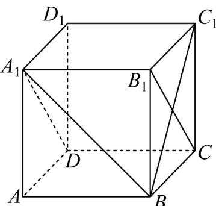

<!-- question-source:start -->
【变式3】如图，在正方体 $ABCD - A_{1}B_{1}C_{1}D_{1}$ 中， $AB = 1$ .

(1)求证： $AB\| \text{平面}^{A_1DCB_1}$

(2)求点 A 到面 $A_{1}BD$ 的距离.
<!-- question-source:end -->

![[高中/课堂同步/题库/人教A版高中数学同步讲义(2026)/02_必修第二册/第八章 立体几何初步/讲义/专题8_4_空间点_直线_平面之间的位置关系_高效培优讲义_/题型07_直线与平面的位置关系_sec_17/questions/answers/Q00065193A1.md]]
