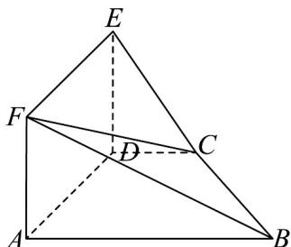

<!-- question-source:start -->
【变式3】如图，在几何体 $ABCDEF$ 中，侧面 $ADEF$ 是正方形， $DE \perp CD$ ， $CD // AB$ ， $\angle ADC = 90^{\circ}$ ，

$AD = 2CD = 4$ ，且 $BF$ 与平面 $ABCD$ 所成角为 $45^{\circ}$

(1)求证：平面 ADEF ⊥ 平面 ABCD；

(2)求四棱锥 E-ABCD 的体积；

(3)若平面 CBF 与棱 DE 交于点 G，求四边形 CBFG 的面积.
<!-- question-source:end -->

![[高中/课堂同步/题库/人教A版高中数学同步讲义(2026)/02_必修第二册/第八章 立体几何初步/讲义/专题8_4_空间点_直线_平面之间的位置关系_高效培优讲义_/题型07_直线与平面的位置关系_sec_17/questions/answers/Q00065196A1.md]]
