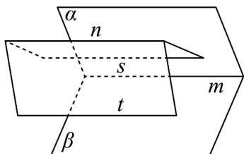

> [!faq]- 《专题8_4_空间点_直线_平面之间的位置关系_高效培优讲义_》官方解析
>
> > [!success]- **【答案】** A. 若 $m \parallel n$ ，则 $n \parallel \alpha$ 且 $n \parallel \beta$ B．若 $m\parallel n$ ，则n平行于平面 $a$ 内的无数条直线 C. 若 $n \parallel \alpha$ 且 $n \parallel \beta$ , 则 $m \parallel n$ D．若 n 在平面 $\beta$ 外，则 m 与 n 平行或异面
>
> > [!note]- **【分析】**
> > 根据题意，由空间中直线与平面的位置关系，对选项逐一判断，即可得到结果·
>
> > [!note]- **【解析】**
> > 对于 A，若 $m \parallel n$ ，则 $n \parallel \alpha$ 且 $n \parallel \beta$ 或 $n \subset \alpha$ 或 $n \subset \beta$ ，故 A 错误；
> >
> > 对于 B，若 $m \parallel n$ ， $\alpha \cap \beta = m$ ，因为 $m \subset \alpha$ ，过直线 n 可以有无数个平面与 $\alpha$ 相交，
> >
> > 则交线与直线 n 平行，故 B 正确；
> >
> > 对 $C$ ，过直线 $n$ 分别作两平面与 $\alpha, \beta$ 分别相交于直线 $s$ 和直线 $t$ ，
> >
> > 因为 $n / / \alpha$ ，过直线 $n$ 的平面与平面 $\alpha$ 的交线为直线 $s$ ，
> >
> > 则根据线面平行的性质定理知 $n / / s$
> >
> > 同理可得 $n / / t$ ，则 $s / / t$ ，因为 $s\notin$ 平面 $\beta$ ， $t\subset$ 平面 $\beta$ ，则 $s / /$ 平面 $\beta$
> >
> > 因为 $s \subset$ 平面 $\alpha$ ， $\alpha \cap \beta = m$ ，则 $s // m$ ，又因为 $n // s$ ，则 $m // n$ ，故 C 正确；
> >
> > 
> >
> > 对于 D，若 n 在平面 $\beta$ 外，则 $n // \beta$ 或 n 与 $\beta$ 相交，
> >
> > 当则 $n // \beta$ 时， $m // n$ 或 m, n 异面，
> >
> > 当 $n$ 与 $\beta$ 相交时， $m, n$ 相交或 $m, n$ 异面，故 ${}^{\mathrm{D}}$ 错误；
> >
> > 故选 **BC**
