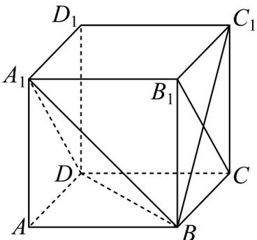
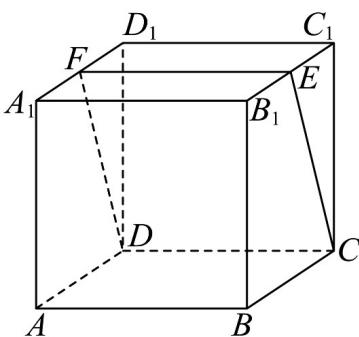
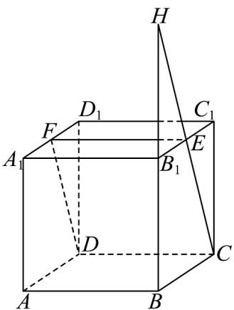

> [!faq]- 《专题8_4_空间点_直线_平面之间的位置关系_高效培优讲义_》官方解析
>
> > [!success]- **【答案】** (1)答案见详解 (2) $\frac{\sqrt{3}}{3}$
>
> > [!note]- **【分析】**
> > （1）利用线面平行的判定定理证明即可；
> >
> > (2) 利用等体积法即 $V_{A_{1}-ABD}=V_{A-A_{1}BD}$ 求解即可.
>
> > [!note]- **【解析】**
> > （1）∵AB∥DC，AB∉平面 $A_{1}DCB_{1}$ ， $DC\subset$ 平面 $A_{1}DCB_{1}$
> >
> > $\therefore AB \parallel$ 平面 $A_{1}DCB_{1}$
> >
> > (2) 连接 BD, 设点 A 到面 $A_{1}BD$ 的距离为 h,
> >
> > 由已知可得 $V_{A_{1}-ABD}=V_{A-A_{1}BD}$ ，
> >
> > 由正方体的性质可知 $A_{1}A \perp$ 平面 ABD，则 $V_{A_{1}-ABD} = \frac{1}{3} \cdot A_{1}A \cdot S_{\triangle ABD} = \frac{1}{3} \times 1 \times \frac{1}{2} = \frac{1}{6}$
> >
> > $$
> > V _ {A - A _ {1} B D} = \frac {1}{3} \cdot h \cdot S _ {\triangle A _ {1} B D} = \frac {h}{3} \times \frac {\sqrt {3}}{2} = \frac {\sqrt {3}}{6} h
> > $$
> >
> > $\therefore \frac{\sqrt{3}}{6}h=\frac{1}{6}$ ，解得 $h=\frac{\sqrt{3}}{3}$
> >
> > 即点 A 到面 $A_{1}BD$ 的距离为 $\frac{\sqrt{3}}{3}$ .
> >
> > 
> > 题型08 平面与平面的位置关系
> >
> > 【典例1】在正方体 $ABCD - A_{1}B_{1}C_{1}D_{1}$ 中， $E, F$ 分别为 $B_{1}C_{1}$ ， $A_{1}D_{1}$ 的中点·求证：平面 $ABB_{1}A_{1}$ 与平面 $CDFE$ 相
> >
> > 交·
> >
> > 
> >
> > 【答案】证明见解析
> >
> > 【分析】由延长 CE 与 $BB_{1}$ ，会相交于一点 H，即可求证；
> >
> > 【详解】证明：在正方体 $ABCD - A_{1}B_{1}C_{1}D_{1}$ 中，E 为 $B_{1}C_{1}$ 的中点，
> >
> > $\therefore EC_{与}B_{1}B_{不平行}$
> >
> > 延长 $CE$ 与 $BB_{1}$ ，延长线相交于一点 $H$ ，
> >
> > $\therefore H\in EC\quad H\in B_{1}B$
> >
> > 
> >
> > 又 $B_{1}B\subset$ 平面 $ABB_{1}A_{1}$ ， $CE\subset$ 平面CDFE
> >
> > $\therefore H \in_{\text{平面}} ABB_1A_1$ ， $H \in_{\text{平面}} CDFE$
> >
> > 所以平面 $ABB_{1}A_{1}$ 与平面 CDFE 相交.
> >
> > ## 方法技巧
> >
> > 平面与平面位置关系的解题思路
> >
> > 判断线线、线面、面面的位置关系，要牢牢地抓住其特征与定义、要有画图的意识，结合空间想象能力全方
> >
> > 位、多角度地去考虑问题，作出判断．常借助长方体模型进行判断．
