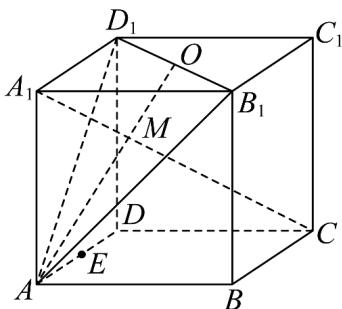
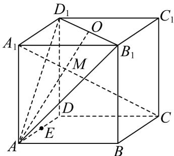

> [!faq]- 《专题8_4_空间点_直线_平面之间的位置关系_高效培优讲义_》官方解析
>
> > [!success]- **【答案】** (1)答案见解析 (2)答案见解析 (3)答案见解析 (4)答案见解析
>
> > [!note]- **【分析】**
> > 在正方体 $ABCD - A_{1}B_{1}C_{1}D_{1}$ 中，举例证明（1）（2）不正确，同时证明（4）正确，再结合图形关系
> >
> > 判断 $( ^{3} )$ 即可·
>
> > [!note]- **【解析】**
> > （1）
> >
> > 
> >
> > 对于（1）：如图 A、D、E 三个公共点在一条直线上，平面 ABCD 与平面 $ADD_{1}A_{1}$ 相交不重合，故（1）不正
> >
> > 确；
> >
> > (2) 对于 (2): 正方体中从点 $A$ 出发的三条棱 $AA_{1}, AB, AD$ 不在同一个平面内, 故 (2) 不正确;
> >
> > (3) 对于 (3)，若 $a // b$ 则 $a, b$ 确定一个平面，且 $a, b$ 与直线 $c, d$ 的交点都在此平面内，则 $c, d$ 共面，与 $c, d$
> >
> > 是异面直线矛盾，
> >
> > 故直线 $a, b$ 可能是异面直线，也可能是相交直线，
> >
> > 图形可以取 $a = A_{1}C, b = AB, c = AA_{1}, d = BC$ 或 $a = AD_{1}, b = AB_{1}, c = AA_{1}, d = B_{1}D_{1}$ 故（3）正确；
> >
> > 
> >
> > (4) 对于 (4)，平面 $A_{1}C \cap$ 平面 $AB_{1}D_{1} = AO$ ，
> >
> > 因为直线 $A_{1}C$ 交平面 $AB_{1}D_{1}$ 于点 M ，
> >
> > 所以 $M \in AO$ ，即 A, M, O 三点共线，
> >
> > 因为 $A, M, O$ 三点共线，直线和直线外一点可以确定一个平面，
> >
> > 所以 A, O, C, M 四点共面，故（4）正确·
