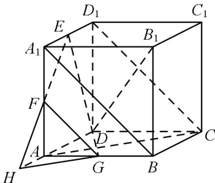

> [!faq]- 《专题8_4_空间点_直线_平面之间的位置关系_高效培优讲义_》官方解析
>
> > [!success]- **【答案】** ①②④
>
> > [!note]- **【解析】**
> > - **对于①**：，根据 $CD_{1} // BA_{1}$ ， $BA_{1} // FG$ ，可得 $CD_{1} // FG$ ；
> > - **对于②**：，延长 $EF$ 交 $DA$ 的延长线于 $H$ ，连 $HG$ ，通过证明 $HG // AC$ 可证 $AC //$ 平面 $EFG$ ；
> > - **对于③**：，平面 $EHG$ 与平面 $ABC$ 所成二面角不是直角可知平面 $BAC$ 与平面 $EFG$ 不垂直；
> > - **对于④**：，可证 $B_{1}D \perp$ 平面FHG，从而可得 $B_{1}D \perp EG$ .
> >
> > 【详解】
> >
> > 
> > - **对于①**：，在正方体 $ABCD-A_{1}B_{1}C_{1}D_{1}$ 中， $CD_{1}//BA_{1}$ ， $BA_{1}//FG$ ，所以 $CD_{1}//FG$ ，故①正确；
> > - **对于②**：，延长 $EF$ 交 $DA$ 的延长线于 $H$ ，连 $HG$ ，则 $AH = A_{1}E = AG$
> >
> > 所以 HG // AC，又 $HG \subset$ 平面 EFG， $AC \notin$ 平面 EFG，所以 AC // 平面 EFG，故②正确；
> > - **对于③**：，平面 BAC 与平面 EFG 不垂直；故③不正确；
> > - **对于④**：，在正方体中，因为 $B_{1}D \perp CD_{1}$ ， $CD_{1} // FG$ ，所以 $B_{1}D \perp FG$
> >
> > 因为 $B_{1}D^{\wedge}AC$ ， $AC / / HG$ ，所以 $B_{1}D\perp HG$ ，因为 $FG\cap HG = G$
> >
> > 所以 $B_{1}D \perp$ 平面 FHG，又 $EG \subset$ 平面 FHG，所以 $B_{1}D \perp EG$ ，故④正确·
> >
> > 故答案为：①②④
