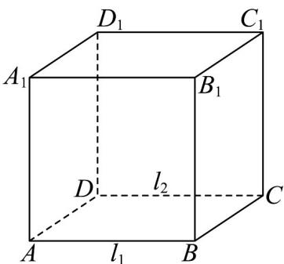

## 题型07 直线与平面的位置关系

【典例1】已知直线 $l_{1}, l_{2}$ ，平面 $\alpha, l_{1} // l_{2}, l_{1} // \alpha$ ，那么 $l_{2}$ 与平面 $\alpha$ 的关系是（）A. $l_{2} // \alpha$ B. $l_{2} \perp \alpha$ C. $l_{2} // \alpha$ 或 $l_{2} \subset \alpha$ D. $l_{2}$ 与 $\alpha$ 相交

【答案】C

【分析】以正方体为载体，取 $AB = l_{1}$ ， $CD = l_{2}$ ，分别取面 $CDD_{1}C_{1}$ 和 $B_{1}A_{1}D_{1}C_{1}$ 为平面 $\alpha$ ，即可判断结果：

【详解】

在正方体 $ABCD - A_{1}B_{1}C_{1}D_{1}$ 中，取 $AB = l_{1}$ ， $CD = l_{2}$

当取面 $CDD_{1}C_{1}$ 为平面 $\alpha$ 时，

所以满足 $l_{1} // l_{2}$ ， $l_{1} // \alpha$ ，此时 $l_{2} \subset \alpha$ ；

当取面 $B_{1}A_{1}D_{1}C_{1}$ 为平面 $\alpha$ 时，

所以满足 $l_{1} / / l_{2}$ ， $l_{1} / / \alpha$ ，此时 $l_{2} / / \alpha$

所以 $l_{2}$ 与平面 $\alpha$ 的关系是 $l_{2} \parallel \alpha$ 或 $l_{2} \subset \alpha$ .

故选：C·

## 方法技巧

直线与平面位置关系的解题思路

解决此类问题首先要搞清楚直线与平面各种位置关系的特征，利用其定义作出判断，要有画图意识，并借助

空间想象能力进行细致的分析.

![[高中/课堂同步/题库/人教A版高中数学同步讲义(2026)/02_必修第二册/第八章 立体几何初步/讲义/专题8_4_空间点_直线_平面之间的位置关系_高效培优讲义_/题型07_直线与平面的位置关系_sec_17/questions/Q00065191.md]]
![[高中/课堂同步/题库/人教A版高中数学同步讲义(2026)/02_必修第二册/第八章 立体几何初步/讲义/专题8_4_空间点_直线_平面之间的位置关系_高效培优讲义_/题型07_直线与平面的位置关系_sec_17/questions/Q00065192.md]]
![[高中/课堂同步/题库/人教A版高中数学同步讲义(2026)/02_必修第二册/第八章 立体几何初步/讲义/专题8_4_空间点_直线_平面之间的位置关系_高效培优讲义_/题型07_直线与平面的位置关系_sec_17/questions/Q00065193.md]]
![[高中/课堂同步/题库/人教A版高中数学同步讲义(2026)/02_必修第二册/第八章 立体几何初步/讲义/专题8_4_空间点_直线_平面之间的位置关系_高效培优讲义_/题型07_直线与平面的位置关系_sec_17/questions/Q00065194.md]]
![[高中/课堂同步/题库/人教A版高中数学同步讲义(2026)/02_必修第二册/第八章 立体几何初步/讲义/专题8_4_空间点_直线_平面之间的位置关系_高效培优讲义_/题型07_直线与平面的位置关系_sec_17/questions/Q00065195.md]]
![[高中/课堂同步/题库/人教A版高中数学同步讲义(2026)/02_必修第二册/第八章 立体几何初步/讲义/专题8_4_空间点_直线_平面之间的位置关系_高效培优讲义_/题型07_直线与平面的位置关系_sec_17/questions/Q00065196.md]]
