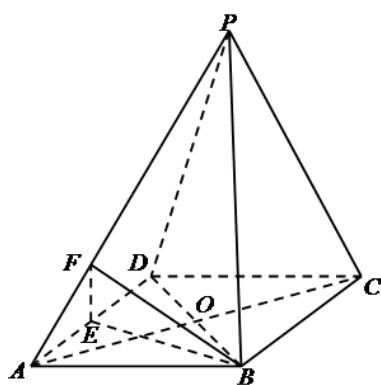

<!-- question-source:start -->
【变式1】如图，已知四棱锥 $P - ABCD$ 的底面是菱形， $AC$ 交 $BD$ 于点 $O$ ， $E$ 为 $AD$ 的中点， $F$ 在 $PA$ 上，

$AP = \lambda AF$ ， $PC / /$ 平面 $BEF$ ，则 $\lambda$ 的值为

<!-- question-source:end -->

![[高中/课堂同步/题库/人教A版高中数学同步讲义(2026)/02_必修第二册/第八章 立体几何初步/讲义/专题8_5_空间直线_平面的平行_高效培优讲义_/_compact/answers/Q00065220A1.md]]
