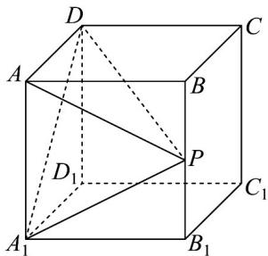

<!-- question-source:start -->
【变式3】如图，在棱长为 $1$ 的正方体 $ABCD - A_{1}B_{1}C_{1}D_{1}$ 中， $P$ 为棱 $BB_{1}$ 的中点， $Q$ 为正方形 $BB_{1}C_{1}C$ 内一动点

(含边界)，则下列说法中正确的是（）

A. 平面 $A_{1}PD$ 截正方体所得截面为等腰梯形

B．若 $CQ_{\parallel}$ 平面 $A_{1}PD$ ，则直线 $CQ$ 不可能垂直于直线 $C_1Q$

C. 若 $D_{1}Q=\frac{\sqrt{6}}{2}$ ，则点 Q 的轨迹长度为 $\frac{\sqrt{2}\pi}{4}$

D．三棱锥 $A-A_{1}PD$ 的外接球的半径为 $\frac{\sqrt{41}}{8}$
<!-- question-source:end -->

![[高中/课堂同步/题库/人教A版高中数学同步讲义(2026)/02_必修第二册/第八章 立体几何初步/讲义/专题8_5_空间直线_平面的平行_高效培优讲义_/_compact/answers/Q00065222A1.md]]
