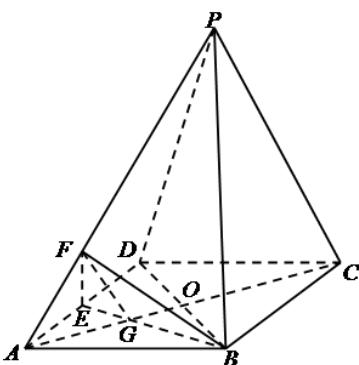

> [!faq]- 《专题8_5_空间直线_平面的平行_高效培优讲义_》官方解析
>
> > [!success]- **【答案】** $^{3}$
>
> > [!note]- **【分析】**
> > 设 $AO$ 与 $BE$ 交于点 $G$ ，连接 $FG$ ，由题意可得 $\triangle AEG\sim \triangle CBG$ ，所以 $\frac{AG}{AC} = \frac{1}{3}$
> >
> > 又由 $PC / /$ 平面 $BEF$ ，可得 $GF / / PC$ ，所以 $\lambda = \frac{AP}{AF} = \frac{AC}{AG} = 3$
>
> > [!note]- **【解析】**
> > 设 AO 与 BE 交于点 G，连接 FG，如图所示，
> >
> > 
> >
> > 因为 $E$ 为 $AD$ 的中点，所以 $AE = \frac{1}{2} AD = \frac{1}{2} BC$
> >
> > 由于四边形 ABCD 是棱形，可得 $AD \parallel BC$ ，则 $\triangle AEG \sim \triangle CBG$ ，所以 $\frac{AG}{GC} = \frac{AE}{BC} = \frac{1}{2}$ ，所以 $\frac{AG}{AC} = \frac{1}{3}$ ，
> >
> > 因为 $PC // \text{平面} BEF$ ， $PC \subset \text{平面} PAC$ ，平面 $BEFI$ 平面 $PAC = GF$ ，所以 $GF // PC$ ，所以 $\lambda = \frac{AP}{AF} = \frac{AC}{AG} = 3$ .
> >
> > 故答案为：3.
