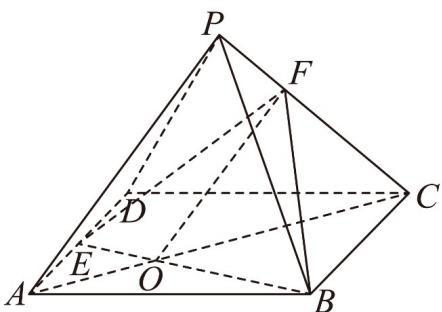

> [!faq]- 《专题8_5_空间直线_平面的平行_高效培优讲义_》官方解析
>
> > [!success]- **【答案】** $\frac{2}{5} / 0.4$
>
> > [!note]- **【分析】**
> > 首先作辅助线，根据相似可求得 $\frac{AO}{OC} = \frac{2}{5}$ ，然后根据线面平行的性质得出线线平行，进而由相似定理可求得 $\frac{PF}{FC} = \frac{AO}{OC} = \frac{2}{5}$ .
>
> > [!note]- **【解析】**
> > 如图，连接 $AC$ 交 $BE$ 于点 $O$ ，连接 $OF$
> >
> > 因为 $AD / / BC, AE:ED = 2:3$ ，所以 $\frac{AO}{OC} = \frac{AE}{BC} = \frac{2}{5}$
> >
> > 因为 $PA / /$ 平面 $EBF$ ，平面 $EBF \cap$ 平面 $PAC = OF, PA \subset$ 平面 $PAC$ ，所以 $PA / / OF$ ，所以 $\frac{PF}{FC} = \frac{AO}{OC} = \frac{2}{5}$ 故答案为： $\frac{2}{5}$ .
> >
> > 
