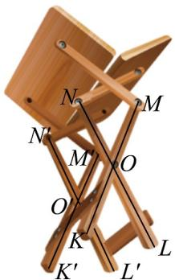
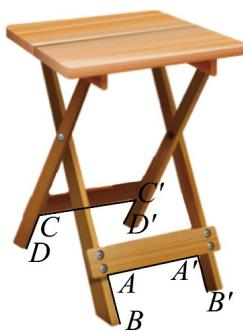

<!-- question-source:start -->
2. 某折叠餐桌的使用步骤如图所示，有如下检查项目：

图1

图2

图3

项目①：折叠状态下（如图 $^{1}$ ），检查四条桌腿长相等；

项目②：打开过程中（如图2），检查 $OM = ON = O'M' = O'N'$ ；

项目③：打开过程中（如图2），检查 $OK = OL = O'K' = O'L'$

项目④：打开后（如图3），检查 $AB = A'B' = CD = C'D'$ ；

项目⑤：打开后（如图 $^{3}$ ），检查 $\angle1=\angle2=\angle3=\angle4=90^{\circ}$ .

下列检查项目的组合中，可以正确判断“桌子打开之后桌面与地面平行”的是（）
A. ①②③
B. ③④⑤
C. ②③⑤
D. ②④⑤
<!-- question-source:end -->

![[高中/课堂同步/题库/人教A版高中数学同步讲义(2026)/02_必修第二册/第八章 立体几何初步/讲义/专题8_5_空间直线_平面的平行_高效培优讲义_/即学即练_sec_06/questions/answers/Q00065208A1.md]]
